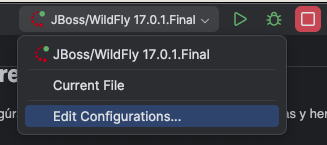
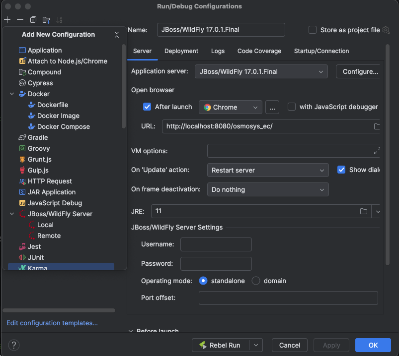
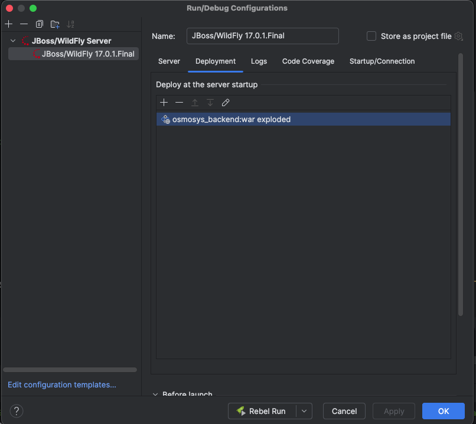
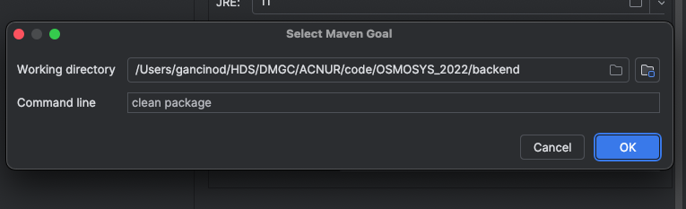
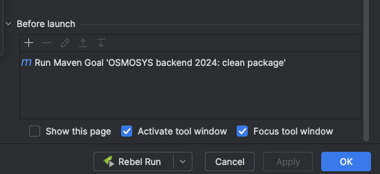
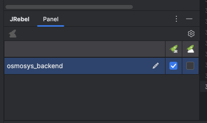
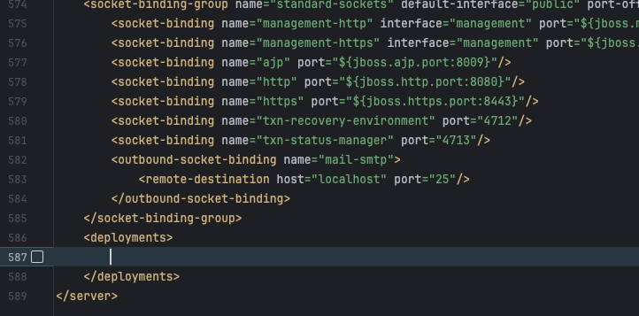
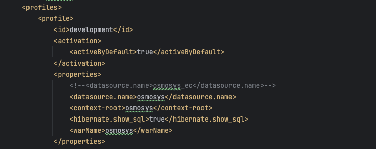

# Osmosys

OSMOSYS (Operation Monitoring System) es un sistema de monitoreo deactividades desarrollado para satisfacer las necesidades específicas de ACNUR. Creado inicialmente en Ecuador en 2021, en 2023 el sistema evolucipnó para ser implementado en El Salvador.

La idea original del sistema fue creada por Jean-Laurent Martin (IM Officer-Ecuador), Sebastián Salazar (IM Officer - El Salvador) and Maybritt Rasmussen (Programme Officer).
## Requisitos previos

Antes de comenzar, asegúrate de tener instalados los siguientes programas y herramientas:

- [Java JDK 11+](https://www.oracle.com/java/technologies/javase-jdk11-downloads.html) 
- [Maven 3.6+](https://maven.apache.org/download.cgi) 
- [WildFly 17](https://www.wildfly.org/downloads/) 
- [Git](https://git-scm.com/) 

## 1. Clonar el repositorio

Clona este repositorio en tu máquina local usando `git`:


link del proyecto
- [Link Github de Osmosys](https://github.com/ACNUR-Ecuador/OSMOSYS_2022) (Dirige al repositorio del proyecto en github)


```bash
git clone https://github.com/ACNUR-Ecuador/OSMOSYS_2022.git
```

## 2. Configuración del proyecto
 
- Instalar Intellij Ultimate
- Instalar plugin Jrebel, activar
- Descargar código desde Github
- Editar Configuración



 - Agregar configuración JBoss/Wildfly Server Local

 

- En la pestaña Deploy al agregar "+" en Deployat the server startup, Agregar el Artefacto como "exploded"



 - En la pestaña Server al agregar "+" en Before Launch, En Command line agregar "clean package" 



 - Borrar cualquier otro comando 
 


 - Presionar botón "Ok" para guardar los cambios y cerrar

 - En el panel de JRebel dar clic en el lápiz para editar



 - Presionar en "Regenerate xml configuration" y luego en "Open rebel.xml" para revisar la información
 - Abrir el archivo standalone.xml al final del archivo borrar la confiuración dentro de deployments



 - Configurar los profiles dentro del archivo pom.xml



 - Arrancar el proyecto dando click en el boton de run/debug de JRebel
