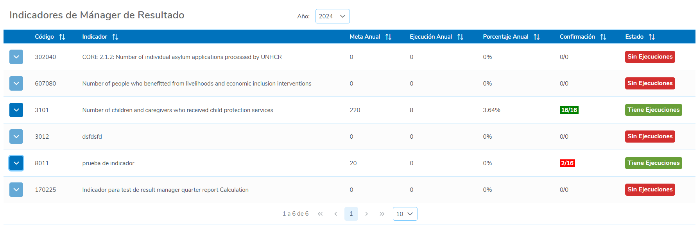
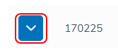
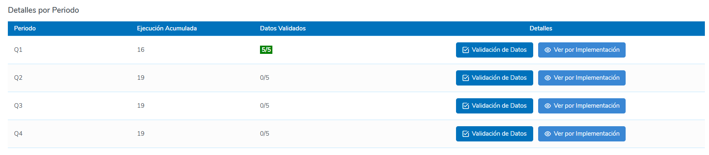
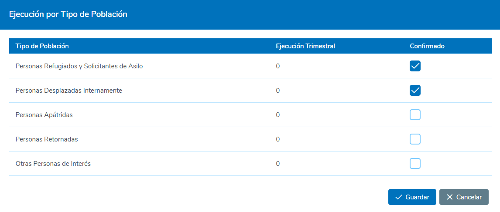

# 1. Mánager de Resultados

Esta sección permite al usuario con el rol de **Mánager de Resultados** gestionar y reportar sobre los indicadores de producto asignados a cada uno de los años correspondientes.

## 1.1 Indicadores del Mánager de Resultados

Para acceder a la pantalla donde se muestra el listado de los indicadores asignados al **Mánager de Resultados**, siga los siguientes pasos:

1. **Ubicar la opción en el Menú**
   - En la parte superior derecha del menú principal, localice y seleccione la opción **Mánager de Resultados**.

2. **Seleccionar "Verificación de Indicadores"**
   - En el menú desplegado, seleccione la opción **"Verificación de Indicadores"**.

     

### 1.2 Tabla de Indicadores

Dentro de la pantalla de **Verificación de Indicadores**, en la parte superior al centro se ubica un campo de selección que permite al usuario cambiar el año en el que va a gestionar los indicadores asignados.

Debajo del mismo se presentará una tabla con los registros de todos los indicadores asignados al usuario como Mánager de Resultados. Los registros incluyen las siguientes columnas de información:

- **Código**: Código único del indicador asignado.
- **Indicador**: Descripción detallada del indicador.
- **Meta Anual**: Meta anual del indicador, que corresponde a la suma de todas las metas de las ejecuciones asignadas a este indicador.
- **Ejecución Anual**: Cantidad total reportada anualmente para este indicador.
- **Porcentaje Anual**: Porcentaje de avance total respecto a la meta anual.
- **Confirmación**: Tasa de confirmación global, que representa la cantidad de confirmaciones realizadas sobre el número total de Tipos de Población en el indicador por cada trimestre. Si no existe una desagregación por Tipo de Población en el indicador, este campo mostrará "0/0".
- **Estado**: El estado indica si el indicador tiene ejecuciones asignadas, es decir, si ya ha sido vinculado a un proyecto o a una implementación directa. Los posibles estados son **"Tiene Ejecuciones"** o **"Sin Ejecuciones"**.

     

### 1.3 Detalle por Trimestre

En esta sección el Usuario prodrá Validar y reportar sobre las Ejecuciones realizadas por cada Trimestre. Para acceder a la información del Detalle por trimestre del Indicador, el Usuario deberá hacer clic en el botón que aparece al incio de cada una de las filas en la tabla.

     

En esta sección se desplegará una tabla que muestra el Detalle de las Ejecuciones del Indicador por cada Trimestre. El detalle de estas se presentan con las siguientes columnas de información:

- **Trimestre**: Trimestre de Ejecución.
- **Ejecución Trimestral**: Cantidad total reportada en el Trimestre.
- **Confirmación Trimestral**: Tasa de confirmación trimestral, que representa la cantidad de confirmaciones realizadas sobre el número total de Tipos de Población para el Trimestre. Los valores aqui mostrados llevan una distinción de colores que representan el estado temprano o tardió de validación de los mismos que será detallado en el apartado de código de colores.
- **Detalles**: En esta columna se presentan 3 botones que le servirá al usuario para validar y reportar los valores trimestrales, estos son:
   - Ver por tipo de Población
   - Ver por implementación
   - Reporte Trimestral

     

#### 1.3.1 Ver por Tipo de Población

Para acceder a esta ventana, el usuario debe hacer clic en el botón **"Ver por Tipo de Población"**, ubicado en la columna de **Detalles** en la tabla de **Detalle por Trimestre**.

Dentro de esta ventana, se mostrarán los valores de **Ejecución Trimestral** por cada Tipo de Población, siempre y cuando el indicador tenga la desagregación por Tipo de Población. Si el indicador no cuenta con esta desagregación, no se mostrará información en esta ventana.

Para validar la **Ejecución Trimestral** de cada Tipo de Población, el usuario debe marcar la casilla correspondiente en la columna **"Confirmado"**.

Una vez validadas las ejecuciones deseadas, el usuario debe hacer clic en el botón **"Guardar"** para registrar los valores.

     

