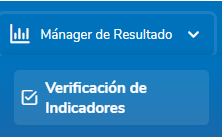
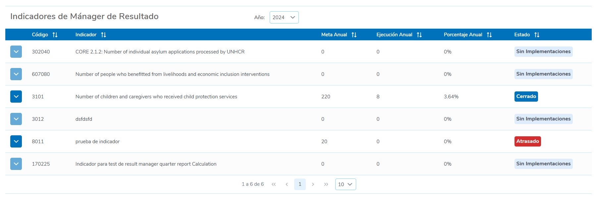
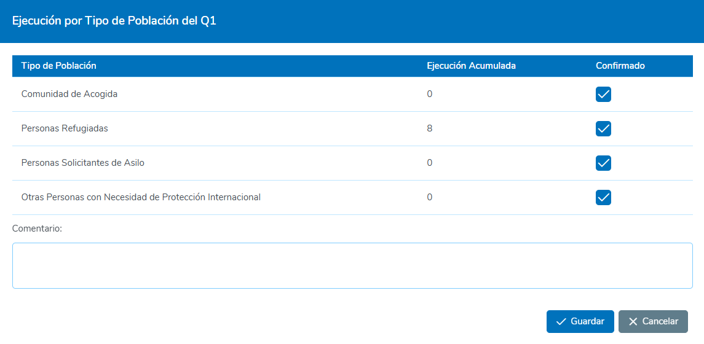
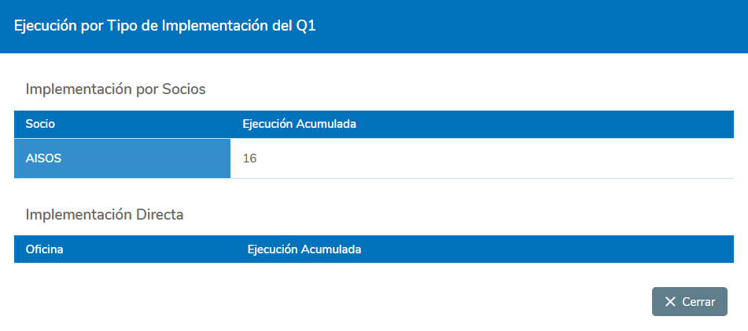

# 1. Mánager de Resultados

Esta sección permite al usuario con el rol de **Mánager de Resultados** gestionar y reportar sobre los indicadores de producto asignados a cada uno de los años correspondientes.

## 1.1 Indicadores del Mánager de Resultados

Para acceder a la pantalla donde se muestra el listado de los indicadores asignados al **Mánager de Resultados**, siga los siguientes pasos:

1. **Ubicar la opción en el Menú**
   - En la parte superior derecha del menú principal, localice y seleccione la opción **Mánager de Resultados**.

2. **Seleccionar "Verificación de Indicadores"**
   - En el menú desplegado, seleccione la opción **"Verificación de Indicadores"**.

     

## 1.2 Tabla de Indicadores

Dentro de la pantalla de **Verificación de Indicadores**, en la parte superior al centro se ubica un campo de selección que permite al usuario cambiar el año en el que va a gestionar los indicadores asignados.

Debajo del mismo se presentará una tabla con los registros de todos los indicadores asignados al usuario como Mánager de Resultados. Los registros incluyen las siguientes columnas de información:

- **Código**: Código único del indicador asignado.
- **Indicador**: Descripción detallada del indicador.
- **Meta Anual**: Meta anual del indicador, que corresponde a la suma de todas las metas de las ejecuciones asignadas a este indicador.
- **Ejecución Anual**: Cantidad total reportada anualmente para este indicador.
- **Porcentaje Anual**: Porcentaje de avance total respecto a la meta anual.
- **Estado**: Indica el estado global de validación de los datos en todos los trimestres para un indicador. Los posibles estados    son:
   - **Sin Implementaciones**: Cuando el indicador aún no ha sido vinculado a ningún proyecto de socio o implementación directa.
   - **A tiempo**: Cuando se esta dentro del periodo establecido para el trimestre actual y no se tiene ninguna validación de datos pendiente de trimestres anteriores.
   - **En Proceso**: Cuando se ha comenzado la validación de datos en el trimestre actual, pero aún no se ha completado, y no existe ninguna validación pendiente de trimestres anteriores.
   - **Atrasado**: Cuando el trimestre ha finalizado, pero aún quedan validaciones de datos pendientes.
   - **Completado**: Cuando se ha terminado la validación de los datos para todos los trimestres del año actual.
   - **Cerrado**: Cuando el año ha finalizado y todas las validaciones de datos para cada trimestre han sido completadas.

     

## 1.3 Detalle por Periodo

En esta sección el Usuario prodrá Validar y reportar sobre las Ejecuciones realizadas por cada Trimestre. Para acceder a la información del Detalle por trimestre del Indicador, el Usuario deberá hacer clic en el botón que aparece al incio de cada una de las filas en la tabla.

     

En esta sección se desplegará una tabla que muestra el Detalle de las Ejecuciones del Indicador por cada Trimestre. El detalle de estas se presentan con las siguientes columnas de información:

- **Periodo**: Trimestre en el año representado por Q1, Q2, Q3, Q4.
- **Ejecución Acumulada**: Cantidad acumulada reportada en el trimestre.
- **Datos Validados**: Tasa de confirmación trimestral, que representa la cantidad de confirmaciones realizadas sobre el número total de Tipos de Población en el trimestre. Los valores aquí mostrados tienen una distinción de colores que representan el estado temprano o tardío de la validación de los datos:
   
   - **Sin color**: Validación de datos a tiempo. Cuando se está dentro del periodo establecido del trimestre correspondiente o todavía no se llega al mismo.
   - **Color amarillo**: Validación de datos en proceso. Cuando se ha comenzado a validar los datos del trimestre actual, pero aún no se ha terminado.
   - **Color verde**: Validación de datos completada. Cuando se han validado todos los datos del trimestre.
   - **Color rojo**: Validación de datos retrasada. Cuando el trimestre ha culminado y todavía no se han terminado de validar todos los datos.
- **Detalles**: En esta columna se presentan dos botones que permiten al usuario validar y reportar los valores trimestrales. Estos botones son:
   - **Validación de Datos**
   - **Ver por implementación**

     

### 1.3.1 Validación de Datos

Para acceder a esta ventana, el usuario debe hacer clic en el botón **"Validación de Datos"**, ubicado en la columna de **Detalles** en la tabla de **Detalle por Periodo**.

Dentro de esta ventana, se mostrarán los valores de **Ejecución Acumulada** para el periodo selecionado por cada Tipo de Población, siempre y cuando el indicador tenga la desagregación por Tipo de Población. Si el indicador no cuenta con esta desagregación, no se mostrará información en esta ventana.

El Contenido en esta Ventana variará según el **Tipo de Cálculo de reporte Trimestral** en el Indicador, los cuales son:
   - Suma de Todo lo reportado
   - Regla de Agregación

#### 1.3.1.1 Validación de Datos para el tipo de Cálculo de Suma de todo lo Reportado

Para este tipo de cálculo, se presentará una tabla con las siguientes columnas:

- **Tipo de Población**: Nombre del tipo de población.
- **Ejecución Acumulada**: Ejecución acumulada por trimestres.
- **Confirmado**: Casilla de verificación que valida el reporte realizado.

Además, se mostrará un campo de **Comentario** que el usuario deberá completar para acompañar el reporte. Si no se marcan todas las casillas de confirmación, este campo será obligatorio; de lo contrario, será opcional.

Para validar la **Ejecución Acumulada** de cada tipo de población, el usuario debe marcar la casilla correspondiente en la columna **"Confirmado"** y, finalmente, presionar el botón **"Guardar"**.

     

#### 1.3.1.2 Validación de Datos para el tipo de Cálculo Regla de Agregación

Para este tipo de cálculo, se presentará una tabla con las siguientes columnas:

- **Tipo de Población**: Nombre del tipo de población.
- **Ejecución Acumulada**: Ejecución acumulada por trimestres.
- **Valor a Reportar**: Valor que el usuario reportará al final para el tipo de población correspondiente.
- **Confirmado**: Casilla de verificación que valida el reporte realizado.

Al pie de la tabla se mostrará una fila informativa que indica el valor total de todos los valores a reportar.

Además, se presentará un campo de **Comentario** que el usuario deberá completar para acompañar el reporte. Este campo será obligatorio para poder guardar los valores ingresados.

Para validar la **Ejecución Acumulada** de cada tipo de población, el usuario debe marcar la casilla correspondiente en la columna **"Confirmado"**, ingresar el valor que desea reportar, completar el comentario y, finalmente, presionar el botón **"Guardar"**.

     

### 1.3.2 Ver por Implementación

Para acceder a esta ventana, el usuario debe hacer clic en el botón **"Ver por Implementación"**, ubicado en la columna de **Detalles** en la tabla **Detalle por Periodo**.

En esta ventana, se mostrarán los valores de **Ejecución Acumulada** correspondientes al periodo seleccionado, organizados por cada tipo de implementación: **Implementación por Socios** o **Implementación Directa**.

- **Implementación por Socios**: En esta sección, se mostrará una tabla con el nombre del socio y la ejecución acumulada del periodo seleccionado.
- **Implementación Directa**: En esta sección, se presentará una tabla con el nombre de la oficina y la ejecución acumulada del periodo seleccionado.

     

