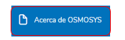
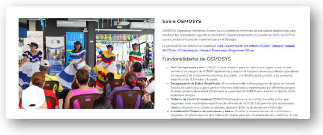

# 6. Acerca de OSMOSYS

La sección "Acerca de OSMOSYS" proporciona al usuario una visión general del sistema, incluyendo su origen, propósito, evolución, funcionalidades clave y el equipo responsable de su desarrollo.  
Para ir a esta pantalla, el usuario deberá hacer clic en la sección de **“Acerca de OSMOSYS”** del menú principal.

  

## ¿Qué se encontrará en esta sección?

1. **Descripción General**  
   Información sobre qué es OSMOSYS, destacando su enfoque en el monitoreo de operaciones y actividades, así como una breve historia de su creación e inicio.
   
2. **Principales Funcionalidades**  
   Breve descripción de las herramientas y módulos principales que ofrece el sistema, tales como la gestión de proyectos, monitoreo de indicadores y generación de reportes.
   
3. **Equipo de Desarrollo**  
   Reconocimiento al equipo multidisciplinario detrás del diseño, desarrollo e implementación de OSMOSYS.

  

