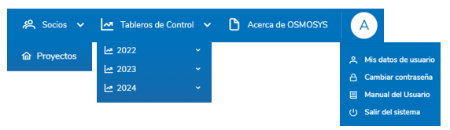

## 3. ESTRUCTURA DEL SISTEMA

## 3.1 Menú Principal
El menú principal incluye las siguientes secciones:

- **Home**: Acceso rápido a Dashboard general de Proyectos, Implementación Directa, Indicadores de producto.
- **Socios**: Reporte y monitoreo de proyectos.
- **Acerca de Osmosys**: Sección descriptiva de la historia, propósito y funcionalidades del sistema de Osmosys.
- **Tableros de Control**: Menú dinámico que generalmente es utilizado para la visualización de dashboards informativos para el monitoreo de las actividades. El acceso a estos dependerá del administrador de la operación.
- **Perfil de Usuario**: Información del usuario, cambio de contraseña, cierre de sesión.

  

