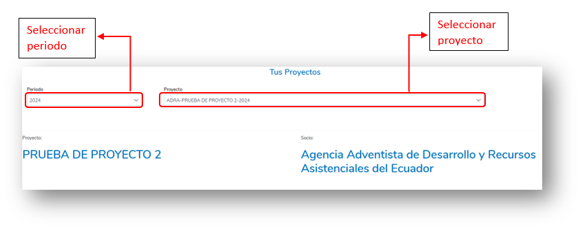
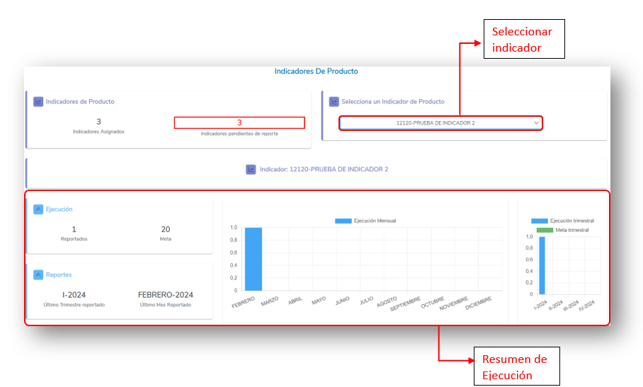

## 4. HOME

Al iniciar sesión en el sistema, el usuario será redirigido automáticamente a la sección **Home**. Esta pantalla principal ofrece un acceso rápido a herramientas de monitoreo clave para facilitar la gestión y visualización de datos relevantes.

En la sección **Home**, el usuario encontrará:

- **Dashboard de Indicadores de Producto de un Proyecto**: Un panel interactivo que muestra los indicadores de ejecución de un proyecto seleccionado, brindando una visión general del progreso y resultados alcanzados del mismo.
- **Dashboard de Indicadores de Producto de Implementación Directa**: Un panel adicional que proporciona un resumen visual del avance y estado de los indicadores de producto de un esquema de implementación directa.

Para volver a la sección **Home** en cualquier momento, el usuario puede hacer clic en el logo de la organización (ACNUR) ubicado en el menú superior principal.

  

### 4.1 Dashboard de Resumen de Indicador de Proyecto

Permite al usuario visualizar el progreso y la ejecución de un indicador de producto asociado a un proyecto específico. Para acceder y analizar esta información, el usuario deberá seguir estos pasos:

1. Seleccionar el periodo de ejecución del Proyecto.
2. Seleccionar el nombre del proyecto.
3. En la sección de **Indicadores de producto** debajo del proyecto, el usuario deberá elegir el indicador que desea visualizar.

  
  

