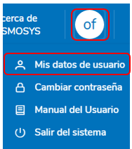
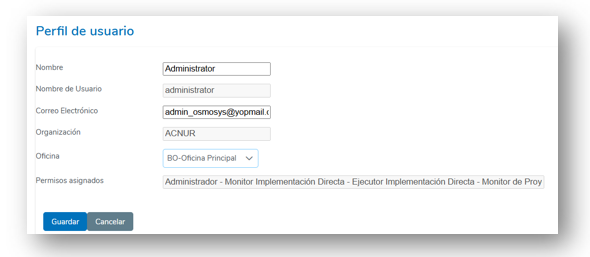
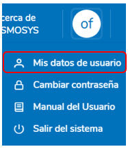
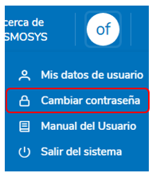
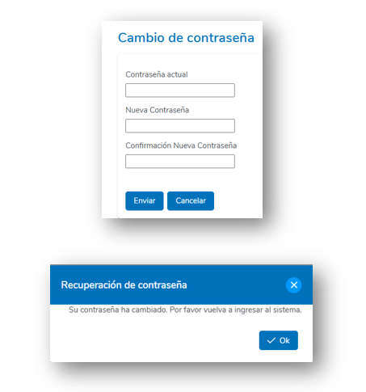
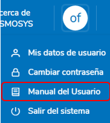
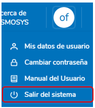

# 7. PERFIL DE USUARIO

La sección **Perfil de Usuario** permite al usuario acceder y gestionar información relacionada con su cuenta en el sistema. Desde esta sección, se pueden visualizar los datos personales, realizar cambios de contraseña y cerrar sesión de manera segura.

## 7.1 Datos del Usuario

El usuario puede acceder a la pantalla de **Datos del Usuario** para consultar y actualizar la información básica asociada a su perfil. A continuación, se describen los pasos para acceder a esta funcionalidad:

1. **Acceso al Perfil**
   - En la parte superior derecha del menú principal, localice el ícono circular que representa su perfil.
   
2. **Seleccionar "Mis Datos de Usuario"**
   - Haga clic en el ícono de perfil para desplegar un menú.
   - En el menú desplegado, seleccione la opción **"Mis datos de usuario"**.

   

     
   

### Visualización de los Datos

Una vez en la pantalla, se mostrarán los datos básicos del usuario, tales como:
- Nombre completo.
- Nombre de Usuario.
- Correo electrónico asociado.
- Organización.
- Oficina (Si es un usuario ACNUR).
- Permisos Asignados.

     

## 7.2 Editar datos del Usuario

Para realizar cambios en los datos personales del usuario, se deberán seguir los pasos descritos a continuación:

1. **Acceso a la Pantalla de Perfil de Usuario**
   - Diríjase a la sección de **Perfil de Usuario** haciendo clic en el ícono circular ubicado en la parte superior derecha del menú principal.
   - En el menú desplegado, seleccione la opción **"Mis datos de usuario"**.

2. **Edición de la Información**
   - En la pantalla de **Perfil de Usuario**, se mostrarán los campos de información personal, como:
     - Nombre completo.
     - Correo electrónico.
     - Otros datos relevantes según configuración del sistema.
   - Para editar un campo, haga clic en el recuadro correspondiente y modifique la información deseada.

**Nota:** Los siguientes campos no son editables:
- Nombre de usuario.
- Organización asignada.
- Permisos asignados.

3. **Guardar o Cancelar Cambios**
   - Una vez realizados los cambios, el usuario debe:
     - Hacer clic en el botón **"Guardar"** para aplicar las modificaciones.
     - O bien, seleccionar el botón **"Cancelar"** si no desea guardar los cambios.

     

## 7.3 Cambiar Contraseña

El sistema permite a los usuarios cambiar su contraseña de manera rápida y segura. Para realizar esta acción, siga los pasos a continuación:

1. **Acceso a la Función de Cambio de Contraseña**
   - Haga clic en el ícono circular ubicado en la esquina superior derecha del menú principal, que representa su perfil de usuario.
   - En el menú desplegable, seleccione la opción **"Cambiar contraseña"**.

     

### Formulario de Cambio de Contraseña

Se abrirá un formulario donde el usuario deberá ingresar la siguiente información:
- **Contraseña actual**: Ingrese la contraseña que utiliza actualmente.
- **Nueva contraseña**: Introduzca una nueva contraseña que cumpla con las políticas de seguridad del sistema (por ejemplo, longitud mínima, uso de caracteres especiales, etc.).
- **Confirmar nueva contraseña**: Escriba nuevamente la nueva contraseña para confirmar que coincide.

2. **Guardar los Cambios**
   - Haga clic en el botón **"Guardar"** para actualizar la contraseña.
   - Si no desea realizar el cambio, puede hacer clic en **"Cancelar"** para salir sin modificar nada.

### Confirmación del Cambio

Una vez guardados los cambios, el sistema mostrará un mensaje de confirmación indicando que la contraseña ha sido actualizada con éxito y que se debe volver a ingresar al sistema.

     

## 7.4 Manual de Usuario

La opción **Manual de Usuario** redirige a la documentación del sistema, permitiendo al usuario consultar cualquier tema relacionado con su uso.

Para acceder al manual, el usuario debe hacer clic en el ícono circular ubicado en la esquina superior derecha del menú principal y luego seleccionar la opción **Manual de Usuario**.

     

## 7.5 Cerrar Sesión

El sistema permite al usuario cerrar sesión de forma segura para proteger su cuenta y los datos asociados. A continuación, se describen los pasos para realizar esta acción:

1. **Acceso a la Opción de Cerrar Sesión**
   - Haga clic en el ícono circular ubicado en la esquina superior derecha del menú principal, que representa su perfil de usuario.
   - En el menú desplegable, seleccione la opción **"Salir del sistema"**.

2. **Confirmación del Cierre de Sesión**
   - Al seleccionar esta opción, el sistema cerrará la sesión activa y redirigirá al usuario a la pantalla de inicio de sesión del sistema.

     

