## 5. ADMINISTRACIÓN DEL SISTEMA

En la sección de **Administración** el usuario podrá configurar los bloques principales de gestión y monitoreo de actividades, configurar aspectos globales del sistema y enviar alertas a los demás usuarios.

### 5.1 Usuarios

En la pantalla de **Usuarios** se podrá crear, consultar, y modificar los datos personales de un usuario del sistema, aquí además se podrá asignar los roles correspondientes al mismo.

Para acceder a los **Usuarios** se debe dar clic en el menú en la sección de “Administración”, luego en la opción de “Configuración del sistema” y por último dar clic sobre la opción de **Usuarios**.

  
  

Dentro de la pantalla de **Usuarios** tenemos en la parte superior derecha 2 botones los cuales permiten al usuario:

- Crear nuevos usuarios
- Exportar la información de la tabla a un archivo tipo “.xls”.

  

### 5.1.1 Roles de Usuario

Los **Roles de usuario** son un conjunto de actividades específicas que va a desempeñar un usuario dentro del sistema. A continuación, se detallan los tipos de roles y sus funciones dentro del sistema.

- **Superadministrador**: Usuario que tiene acceso a todas las funcionalidades dentro del sistema, creación, gestión, configuración, monitoreo, generación de reportes.
  
  **Menús de acceso**:
  - Administración: Configuración del Sistema (Parámetros de Configuración, Áreas, Grupos Poblacionales, Año, Oficinas, Implementadores, Tags, Desagregaciones Personalizadas, Usuarios, Auditoría), Indicadores de Producto, Envío Masivo de correos, Bloqueo Masivo de Indicadores, Menús de Tableros
  - Socios: Proyectos
  - Implementación directa: Reporte de Indicadores
  - Reportes: Catálogo de indicadores, Exportación de datos, Reportes de retrasos
  - Home
  - Acerca de OSMOSYS

- **Administrador Regional**: Usuario que tiene acceso a todas las funcionalidades dentro del sistema, creación, gestión, configuración, monitoreo, generación de reportes.

  **Menús de acceso**:
  - Administración: Configuración del Sistema (Parámetros de Configuración, Áreas, Grupos Poblacionales, Año, Oficinas, Implementadores, Tags, Desagregaciones Personalizadas, Usuarios, Auditoría), Indicadores de Producto, Envío Masivo de correos, Bloqueo Masivo de Indicadores, Menús de Tableros
  - Socios: Proyectos
  - Implementación directa: Reporte de Indicadores
  - Reportes: Catálogo de indicadores, Exportación de datos, Reportes de retrasos
  - Home
  - Acerca de OSMOSYS

- **Administrador Local**: Usuario que tiene acceso a la mayoría de las funciones del sistema excepto a algunos parámetros de configuración dentro del menú de Administración.

  **Menús de acceso**:
  - Administración: Configuración del Sistema (Oficinas, Implementadores, Tags, Desagregaciones Personalizadas, Usuarios, Auditoría), Indicadores de Producto, Envío Masivo de correos, Bloqueo Masivo de Indicadores, Menús de Tableros
  - Socios: Proyectos
  - Implementación directa: Reporte de Indicadores
  - Reportes: Catálogo de indicadores, Exportación de datos, Reportes de retrasos
  - Home
  - Acerca de OSMOSYS

- **Ejecutor de Proyectos**: Usuario implementador que puede realizar reportes en Indicadores de Proyectos, generar diferentes reportes de indicadores.

  **Menús de acceso**:
  - Socios: Proyectos
  - Home
  - Acerca de OSMOSYS

- **Monitor de Proyectos**: Usuario implementador que puede revisar, monitorear reportes en Indicadores de Proyectos, generar diferentes reportes de indicadores.

  **Menús de acceso**:
  - Socios: Proyectos
  - Home
  - Acerca de OSMOSYS

- **Ejecutor de Implementación Directa**: Usuario de ACNUR que puede realizar reportes en Indicadores de Implementación directa, generar diferentes reportes de indicadores.

  **Menús de acceso**:
  - Implementación directa: Reporte de Indicadores
  - Reportes: Catálogo de indicadores, Exportación de datos, Reportes de retrasos
  - Home
  - Acerca de OSMOSYS

- **Monitor de Implementación Directa**: Usuario de ACNUR que puede revisar, monitorear reportes en Indicadores de Implementación directa, generar diferentes reportes de indicadores.

  **Menús de acceso**:
  - Implementación directa: Reporte de Indicadores
  - Reportes: Catálogo de indicadores, Exportación de datos, Reportes de retrasos
  - Home
  - Acerca de OSMOSYS

- **Punto Focal**: El usuario punto focal puede crear nuevos usuarios con permisos por debajo del Superadministrador, Administrador Regional y Administrador Local, es capaz de crear nuevos proyectos, realizar reportes en indicadores de ejecución, generar reportes de proyectos.

  **Menús de acceso**:
  - Administración: Configuración del Sistema (Usuarios), Indicadores de Producto (Indicadores Socios)
  - Socios: Proyectos
  - Reportes: Reportes de retrasos
  - Home
  - Acerca de OSMOSYS

- **Administrador de Oficina**: El usuario administrador de oficina puede crear nuevos usuarios con permisos por debajo del Superadministrador, Administrador Regional y Administrador Local, es capaz de crear implementaciones directas.

  **Menús de acceso**:
  - Administración: Configuración del Sistema (Usuarios), Indicadores de Producto (Indicadores Implementación Directa)
  - Implementación directa: Reporte de Indicadores
  - Home
  - Acerca de OSMOSYS

### 5.1.2 Crear Nuevo Usuario

Para crear un nuevo usuario se deberá dirigir a los botones de la parte superior derecha de la pantalla de **Usuarios** y presionar sobre el botón de “Crear”, a continuación, se desplegará un formulario el cual se deberá completar con cada uno de los campos que se presenten. Por último, se deberá presionar sobre el botón “Guardar” para crear el nuevo usuario o en “Cancelar” si no se desea hacerlo.

Se debe completar cada uno de los campos del formulario para que el botón de “Guardar” se habilite.

  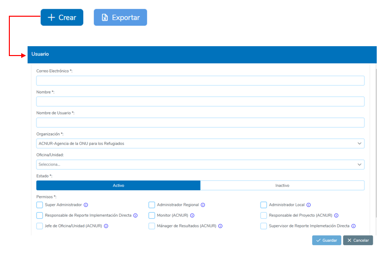

**Campos de Ingreso**:

- Correo electrónico: Correo electrónico del usuario.
- Nombre: Nombre completo del usuario.
- Nombre de usuario: Username del usuario para el inicio de sesión.
- Organización: Nombre de la Organización a la que pertenece.
- Oficina: Nombre de la oficina a la que pertenece el usuario, esta opción es necesaria únicamente si la Organización es ACNUR.
- Estado: El estado del usuario este puede ser “Activo” o “Inactivo”.
- Permisos: Roles que tendrá el usuario nuevo, estos pueden ser: Super Administrador, Administrador Regional, Administrador Local, Ejecutor de Proyectos, Monitor de Proyectos, Ejecutor de Implementación directa, Monitor de Implementación directa.

Los permisos de **Punto Focal** y **Administrador de Oficina** no pueden asignarse directamente dentro de la Administración de Usuarios, estos se conceden al momento de asignar a un usuario como punto focal de un proyecto o como administrador de una oficina correspondientemente en los bloques de **Operación de Indicadores de Socios** y **Administración de Oficinas**.

Una vez guardado el usuario aparecerá un mensaje de guardado exitoso.

  

En caso de que el nombre de usuario ingresado ya existía previamente aparecerá el siguiente mensaje de error.

  

### 5.1.3 Tabla de Usuarios

Dentro de la pantalla de **Usuarios** podremos observar una tabla de los registros de todos los usuarios que se hayan creado en el sistema, estos registros aparecerán con las columnas de información más relevantes, en caso de querer mostrar otra columna el usuario podrá hacer clic en la parte superior de la tabla y seleccionar las columnas de información que requiere mostrar.

  

En cada columna de la tabla el usuario podrá aplicar un filtro para poder buscar algún registro en específico, estos filtros pueden aplicarse de manera simultánea si se quieren colocar más de uno. 

  

Para eliminar el filtro el usuario puede dar clic en el ícono de filtro que se encuentra a lado del campo.

  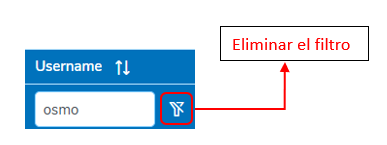

### 5.1.4 Edición de Usuarios

Para editar un usuario, se debe dirigir a la tabla de **Usuarios**, encontrar el registro de usuario que se desea modificar y hacer clic en el ícono de lápiz ubicado en la última columna.

En la pantalla que se despliega se mostrará un formulario con toda la información actual del usuario, se podrá editar cualquiera de estos campos a excepción del nombre de usuario. Una vez realizada la modificación se tendrá que hacer clic sobre el botón de “Guardar”, caso contrario se puede hacer clic en el botón de “Cancelar” si no se requiere realizar ningún cambio.

  
  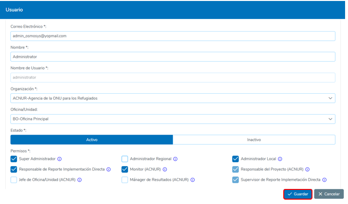

Una vez guardado los cambios aparecerá un mensaje de guardado exitoso.

  

### 5.1.5 Deshabilitar Usuarios

El sistema OSMOSYS permite deshabilitar usuarios para que no puedan acceder ni participar en las operaciones. Para deshabilitar o dar de baja a un usuario, se deberá seguir los siguientes pasos:

1. Acceder a la Tabla de Usuarios: Ingresar al módulo correspondiente y localizar la Tabla de Usuarios. Identificar al usuario que desea deshabilitar.
2. Editar al Usuario: Dar clic en el ícono de lápiz ubicado en la fila del usuario que desea inhabilitar. Esto abrirá el formulario de edición del usuario.
3. Cambiar el Estado a "Inactivo": En el formulario de edición, localizar el campo "Estado" y cambiar su valor a "Inactivo".
4. Guardar los Cambios: Una vez actualizado el estado, dar clic en el botón "Guardar" para confirmar la modificación.
5. Confirmación de guardado: El sistema mostrará un mensaje de confirmación indicando que los datos han sido guardados exitosamente. A partir de este momento, el usuario estará completamente inhabilitado para acceder al sistema o participar en cualquier bloque de operación.

  
  

### 5.1.6 Exportar Usuarios

Para poder exportar la tabla de usuarios existentes en el sistema se deberá dirigir a la parte superior de la pantalla de **Usuarios** y dar clic sobre el botón de “Exportar”.

Inmediatamente se empezará a descargar un archivo en formato Excel con la información de la tabla. Si la tabla se encontraba con algún filtro aplicado, se exportarán los registros de usuarios que aparecen con este filtro.

  

# 5.2 Tags

En la sección de **Tags** se podrá crear, consultar y modificar la información de los tags del sistema.  
Para acceder a los **Tags**, se debe dar clic en el menú en la sección de **“Administración”**, luego en la opción de **“Configuración del sistema”** y por último dar clic sobre la opción de **Tags**.

  
  

Dentro de la pantalla de **Tags**, tenemos en la parte superior derecha 2 botones que permiten al usuario:
- Crear nuevos tags
- Exportar la información de la tabla a un archivo tipo “.xls”.

  

## 5.2.1 Crear Nuevo Tag

Para crear un nuevo **tag**, se deberá dirigirse a los botones de la parte superior derecha de la pantalla de **Tags** y presionar sobre el botón de **“Crear”**. A continuación, se desplegará un formulario que se deberá completar con cada uno de los campos presentados.  
Por último, se deberá presionar sobre el botón **“Guardar”** para crear un nuevo tag o en **“Cancelar”** si no se desea hacerlo.  
Es importante completar cada uno de los campos para que el botón de **“Guardar”** se habilite.

### Campos de Ingreso:
- **Nombre**: Nombre del tag.
- **Descripción**: Descripción del tag.
- **Periodo**: Periodo en el cual el tag será aplicado.
- **Cálculo**: Cálculo del tag (Suma, Máximo, Mínimo, Promedio).
- **Estado**: El estado del tag, puede ser **“Activo”** o **“Inactivo”**.
- **Indicadores**: Lista de Indicadores disponibles en el periodo seleccionado en los que el tag será asignado.

  

## 5.2.2 Tabla de Tags

Dentro de la pantalla de **Tags**, podremos observar una tabla con los registros de todos los tags creados en el sistema. Estos registros aparecerán con las columnas de información más relevantes.  
Si se desea mostrar otra columna, el usuario puede hacer clic en la parte superior de la tabla y seleccionar las columnas de información a mostrar.

  

### Filtros y Ordenación:
- En cada columna de la tabla, el usuario podrá aplicar un filtro para buscar registros específicos. Estos filtros pueden aplicarse simultáneamente.
- Para eliminar un filtro, el usuario puede dar clic en el ícono de filtro que se encuentra junto al campo.

  

- El usuario también podrá ordenar los registros de la tabla de manera ascendente o descendente, haciendo clic en el nombre de la columna deseada.

  

## 5.2.3 Edición de Tags

Para editar un **tag**, se debe:
1. Dirigirse a la tabla de tags.
2. Encontrar el registro de tag que se desea modificar.
3. Hacer clic en el ícono de lápiz ubicado en la última columna.

  

En la pantalla que se despliega, se mostrará un formulario con la información actual del tag.  
Una vez realizada la modificación, se debe hacer clic sobre el botón **“Guardar”**, o en **“Cancelar”** si no se desea realizar ningún cambio.  
Una vez guardados los cambios, aparecerá un mensaje de **guardado exitoso**.

  
  

## 5.2.4 Generar Reporte de Tag

Para generar una plantilla de reporte de un **Tag**, se debe:
1. Dirigirse a la pantalla de **Tags**.
2. Localizar la fila del Tag a generar el reporte.
3. Hacer clic en el botón **“Generar Reporte”**.

Esto descargará un archivo en formato **Excel** del reporte del **Tag** seleccionado.

  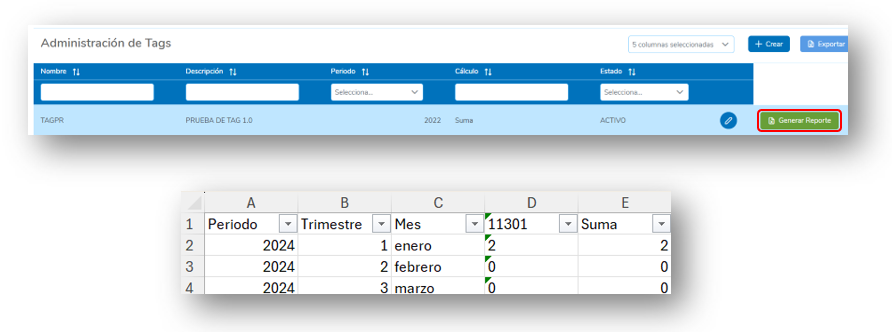

## 5.2.5 Deshabilitar Tags

Para deshabilitar un **tag** y dejarlo completamente inactivo, de manera que no pueda ser asignado a ningún otro bloque de operación, se deberán seguir los siguientes pasos:

1. **Acceder a la Tabla de Tags**: Ingresar al módulo correspondiente y localizar la Tabla de **Tags**. Identificar el tag que se desea deshabilitar.
2. **Editar el Tag**: Dar clic en el ícono de lápiz ubicado en la fila del tag que desea inhabilitar. Esto abrirá el formulario de edición del tag.
3. **Cambiar el Estado a "Inactivo"**: En el formulario de edición, localizar el campo **"Estado"** y cambiar su valor a **"Inactivo"**.
4. **Guardar los Cambios**: Una vez actualizado el estado, dar clic en el botón **"Guardar"** para confirmar la modificación.
5. **Confirmación de guardado**: El sistema mostrará un mensaje de confirmación indicando que los datos han sido guardados exitosamente. A partir de este momento, el tag estará completamente inhabilitado para asignación en cualquier bloque de operación.

  
  

## 5.2.6 Exportar Tags

Para exportar la tabla de **tags** existentes en el sistema, se debe:
1. Dirigirse a la parte superior de la pantalla de **Tags** y dar clic sobre el botón de **“Exportar”**.
2. Inmediatamente, se empezará a descargar un archivo en formato **Excel** con la información de la tabla.

Si la tabla tenía algún filtro aplicado, se exportarán los registros de tags que aparecen con ese filtro.

  

# 5.3 Oficinas

En la sección de **Oficinas** se podrá crear, consultar y modificar la información de las oficinas del sistema.  
Para acceder a las **Oficinas**, se debe dar clic en el menú en la sección de **“Administración”**, luego en la opción de **“Configuración del sistema”** y por último dar clic sobre la opción de **Oficinas**.

  
  

Dentro de la pantalla de **Oficinas**, tenemos en la parte superior derecha 2 botones que permiten al usuario:
- **Crear nuevas oficinas**.
- **Exportar la información de la tabla a un archivo tipo “.xls”**.

  

## 5.3.1 Crear Nueva Oficina

Para crear una nueva **oficina**, se deberá dirigirse a los botones de la parte superior derecha de la pantalla de **Oficinas** y presionar sobre el botón de **“Crear”**. A continuación, se desplegará un formulario que se deberá completar con cada uno de los campos presentados.  
Por último, se deberá presionar sobre el botón **“Guardar”** para crear una nueva oficina o en **“Cancelar”** si no se desea hacerlo.  
Es importante completar cada uno de los campos para que el botón de **“Guardar”** se habilite.

### Campos de Ingreso:
- **Acrónimo**: Acrónimo de la Oficina.
- **Nombre**: Nombre de la oficina.
- **Tipo de oficina**: Tipo de oficina, puede ser **BO**, **Sub-Oficina**, **Oficina de campo**, **Unidad de campo**.
- **Oficina Padre**: Oficina de la cual se deriva la nueva. Esta opción se deshabilita cuando el tipo de oficina es una **“BO”** u **“Oficina Nacional”**.
- **Manager de Oficina/Unidad**: Usuarios que administrarán la oficina.
- **Estado**: El estado de la oficina, puede ser **“Activo”** o **“Inactivo”**.

  

## 5.3.2 Tabla de Oficinas

Dentro de la pantalla de **Oficinas**, podremos observar una tabla con los registros de todas las oficinas creadas en el sistema. Estos registros aparecerán con las columnas de información más relevantes.  
Si se desea mostrar otra columna, el usuario puede hacer clic en la parte superior de la tabla y seleccionar las columnas de información a mostrar.

  

### Filtros y Ordenación:
- En cada columna de la tabla, el usuario podrá aplicar un filtro para buscar registros específicos. Estos filtros pueden aplicarse simultáneamente.
- Para eliminar un filtro, el usuario puede dar clic en el ícono de filtro que se encuentra junto al campo.

  

- El usuario también podrá ordenar los registros de la tabla de manera ascendente o descendente, haciendo clic en el nombre de la columna deseada.

  

## 5.3.3 Edición de Oficinas

Para editar una **oficina**, se debe:
1. Dirigirse a la tabla de oficinas.
2. Encontrar el registro de oficina que se desea modificar.
3. Hacer clic en el ícono de lápiz ubicado en la última columna.

  

En la pantalla que se despliega, se mostrará un formulario con la información actual de la oficina.  
Una vez realizada la modificación, se debe hacer clic sobre el botón **“Guardar”**, o en **“Cancelar”** si no se desea realizar ningún cambio.

  

Una vez guardados los cambios, aparecerá un mensaje de **guardado exitoso**.

  

## 5.3.4 Deshabilitar Oficinas

Para deshabilitar una **oficina** y dejarla completamente inactiva, de manera que no pueda ser asignada a ningún otro bloque de operación, se deberán seguir los siguientes pasos:

1. **Acceder a la Tabla de Oficinas**: Ingresar al módulo correspondiente y localizar la Tabla de **Oficinas**. Identificar la oficina que se desea deshabilitar.
2. **Editar la Oficina**: Dar clic en el ícono de lápiz ubicado en la fila de la oficina que desea inhabilitar. Esto abrirá el formulario de edición de la oficina.
3. **Cambiar el Estado a "Inactivo"**: En el formulario de edición, localizar el campo **"Estado"** y cambiar su valor a **"Inactivo"**.
4. **Guardar los Cambios**: Una vez actualizado el estado, dar clic en el botón **"Guardar"** para confirmar la modificación.
5. **Confirmación de guardado**: El sistema mostrará un mensaje de confirmación indicando que los datos han sido guardados exitosamente. A partir de este momento, la oficina estará completamente inhabilitada para asignación en cualquier bloque de operación.

    
  

## 5.3.5 Exportar Oficinas

Para poder exportar la tabla de **oficinas** existentes en el sistema, se debe:
1. Dirigirse a la parte superior de la pantalla de **Oficinas** y dar clic sobre el botón de **“Exportar”**.
2. Inmediatamente, se empezará a descargar un archivo en formato **Excel** con la información de la tabla.

Si la tabla tenía algún filtro aplicado, se exportarán los registros de oficinas que aparecen con ese filtro.

   
  

## 5.3.6 Organigrama

En la pantalla de **Oficinas**, el sistema permite visualizar un **organigrama** que muestra la distribución y jerarquías de las oficinas registradas. Este gráfico ofrece una representación clara de la estructura organizativa dentro del sistema.

### Para acceder al organigrama:
1. **Ubicar la sección "Organigrama"**:  
   En la parte superior de la pantalla de **Oficinas**, localice la pestaña o botón identificado como **"Organigrama"**.
   
2. **Hacer clic en "Organigrama"**:  
   Haga clic en esta opción para desplegar el gráfico que representa la estructura jerárquica de las oficinas.

El organigrama le permitirá analizar la relación entre las oficinas y su posición dentro de la organización, facilitando la gestión y comprensión de las jerarquías.

   

Para regresar a la tabla de **Oficinas**, deberá dirigirse a la parte superior y dar clic en la pestaña de **“Tabla”**.

   

## 5.4 Marco de resultados
En la sección de marco de resultados se podrá crear, consultar y modificar la información de marco de resultados del sistema.  
Para acceder a los Marco de resultados, se debe dar clic en el menú en la sección de “Administración”, luego en la opción de “Indicadores de Producto” y, por último, dar clic sobre la opción de Marco de resultados.

  
   

Dentro de la pantalla de marco de resultados, tenemos en la parte superior derecha 2 botones, los cuales permiten al usuario:  
- Crear nuevo marco de resultado  
- Exportar la información de la tabla a un archivo tipo “.xls”.

  

### 5.4.1 Crear nuevo Marco de resultado
Para crear un nuevo marco de resultado, se deberá dirigir a los botones de la parte superior derecha de la pantalla de Marco de resultados y presionar sobre el botón de “Crear”. A continuación, se desplegará un formulario el cual se deberá completar con cada uno de los campos que se presenten. Por último, se deberá presionar sobre el botón “Guardar” para crear un nuevo marco de resultado o en “Cancelar” si no se desea hacerlo.  
Se debe completar cada uno de los campos del formulario para que el botón de “Guardar” se habilite.

Campos de Ingreso:
- **Nivel de resultado**: Tipo de Resultado, estos pueden ser (Impacto, Efecto, Producto, Apoyo).  
- **Años**: Años en los cuales el marco de resultado será aplicado.  
- **Área**: Área a la que pertenece el marco de resultado.  
- **Enunciado Padre**: Enunciado del cual se derivará el marco de resultado a crear, este campo puede dejarse en blanco si no hay Marco de resultado Padre.  
- **Código**: Código identificador del marco de resultado.  
- **Grupo poblacional**: Grupo poblacional correspondiente al marco de resultado.  
- **Descripción Completa**: Descripción detallada del marco de resultado.  
- **Estado**: El estado del marco de resultado, este puede ser “Activo” o “Inactivo”.

  

### 5.4.2 Tabla de Marco de resultados
Dentro de la pantalla de Marco de resultados, podremos observar una tabla de los registros de todos los marcos que se hayan creado en el sistema. Estos registros aparecerán con las columnas de información más relevantes. En caso de querer mostrar otra columna, el usuario podrá hacer clic en la parte superior de la tabla y seleccionar las columnas de información que requiere mostrar.

  

En cada columna de la tabla, el usuario podrá aplicar un filtro para poder buscar algún registro en específico. Estos filtros pueden aplicarse de manera simultánea si se desean colocar más de uno.  
Para eliminar el filtro, el usuario puede dar clic en el ícono de filtro que se encuentra al lado del campo.

  

El usuario también podrá ordenar de manera ascendente o descendente los registros de la tabla por una columna específica, dando un clic en el nombre de la columna que desea ordenar de manera ascendente y dando otro clic adicional para ordenar de manera descendente.

  

### 5.4.3 Edición de Marco de resultados
Para editar un marco de resultado, se debe dirigir a la tabla, encontrar el registro de marco de resultado que se desea modificar y hacer clic en el ícono de lápiz ubicado en la última columna.

  

En la pantalla que se despliega se mostrará un formulario con toda la información actual del marco de resultado. Una vez realizada la modificación, se tendrá que hacer clic sobre el botón de “Guardar”. Caso contrario, se puede hacer clic en el botón de “Cancelar” si no se requiere realizar ningún cambio.

  

Una vez guardados los cambios, aparecerá un mensaje de guardado exitoso.

  

### 5.4.4 Deshabilitar Marco de resultados
Para deshabilitar un marco de resultado y dejarlo completamente inactivo, de manera que no pueda ser asignado a ningún otro bloque de operación, se deberá seguir los siguientes pasos:

1. **Acceder a la Tabla de Marco de resultados**: Ingresar al módulo correspondiente y localizar la Tabla de Marco de resultados. Identificar el marco de resultado que se desea deshabilitar.  
2. **Editar el Marco de resultado**: Dar clic en el ícono de lápiz ubicado en la fila del marco de resultado que desea inhabilitar. Esto abrirá el formulario de edición del marco de resultado.  
3. **Cambiar el Estado a "Inactivo"**: En el formulario de edición, localizar el campo "Estado" y cambiar su valor a "Inactivo".  
4. **Guardar los Cambios**: Una vez actualizado el estado, dar clic en el botón "Guardar" para confirmar la modificación.  
5. **Confirmación de guardado**: El sistema mostrará un mensaje de confirmación indicando que los datos han sido guardados exitosamente. A partir de este momento, el marco de resultado estará completamente inhabilitado para asignación en cualquier bloque de operación.

  
  

### 5.4.5 Exportar Marco de resultados
Para poder exportar la tabla de marco de resultados existentes en el sistema, se deberá dirigir a la parte superior de la pantalla de Marco de resultados y dar clic sobre el botón de “Exportar”.  
Inmediatamente se empezará a descargar un archivo en formato Excel con la información de la tabla.  
Si la tabla se encontraba con algún filtro aplicado, se exportarán los registros de marco de resultados que aparecen con este filtro.

  

## 5.5 Desagregaciones personalizadas
En la sección de desagregaciones personalizadas se podrá crear, consultar y modificar la información de las desagregaciones personalizadas del sistema.  
Para acceder a las Desagregaciones personalizadas, se debe dar clic en el menú en la sección de “Administración”, luego en la opción de “Configuración del sistema” y por último dar clic sobre la opción de Desagregaciones personalizadas.

  
  

Dentro de la pantalla de desagregaciones personalizadas, tenemos en la parte superior derecha 2 botones, los cuales permiten al usuario:  
- Crear nuevas desagregaciones personalizadas.  
- Exportar la información de la tabla a un archivo tipo “.xls”.

  

### 5.5.1 Crear nueva Desagregación personalizada
Para crear una nueva desagregación personalizada, se deberá dirigir a los botones de la parte superior derecha de la pantalla de Desagregaciones personalizadas y presionar sobre el botón de “Crear”. A continuación, se desplegará un formulario el cual se deberá completar con cada uno de los campos que se presenten. Por último, se deberá presionar sobre el botón “Guardar” para crear una nueva desagregación personalizada o en “Cancelar” si no se desea hacerlo.  
Se debe completar cada uno de los campos del formulario para que el botón de “Guardar” se habilite.

Campos de Ingreso:
- **Nombre**: Nombre de la Desagregación personalizada.  
- **Opciones**: Opciones que tendrá la desagregación personalizada, se puede crear cada una dando clic en el botón de “Crear opción” que abrirá otro formulario con los siguientes campos:
  - **Nombre**: Nombre de la opción.  
  - **Descripción**: Descripción detallada de la opción de desagregación.  
  - **Estado**: Estado de la opción, esta puede ser “Activo” o “Inactivo”.
- **Estado**: El estado de la desagregación personalizada, esta puede ser “Activo” o “Inactivo”.

  

En la parte inferior del formulario de Creación tendremos una tabla con las opciones de desagregación que vayamos añadiendo según lo necesitemos. Dentro de esta tabla podremos realizar filtros de búsqueda para localizar alguna opción en concreto y también podremos mostrar u ocultar las columnas de información para las mismas.

  

### 5.5.2 Tabla de Desagregaciones personalizadas
Dentro de la pantalla de Desagregaciones personalizadas, podremos observar una tabla de los registros de todas las desagregaciones personalizadas que se hayan creado en el sistema. Estos registros aparecerán con las columnas de información más relevantes. En caso de querer mostrar otra columna, el usuario podrá hacer clic en la parte superior de la tabla y seleccionar las columnas de información que requiere mostrar.

  

En cada columna de la tabla, el usuario podrá aplicar un filtro para poder buscar algún registro en específico. Estos filtros pueden aplicarse de manera simultánea si se quieren colocar más de uno.  
Para eliminar el filtro, el usuario puede dar clic en el ícono de filtro que se encuentra al lado del campo.

  
  

El usuario también podrá ordenar de manera ascendente o descendente los registros de la tabla por una columna específica, dando un clic en el nombre de la columna que desea ordenar de manera ascendente y dando otro clic adicional para ordenar de manera descendente.

  

### 5.5.3 Edición de Desagregaciones personalizadas
Para editar una desagregación personalizada, se debe dirigir a la tabla de desagregaciones personalizadas, encontrar el registro de desagregación personalizada que se desea modificar y hacer clic en el ícono de lápiz ubicado en la última columna.

  

En la pantalla que se despliega se mostrará un formulario con toda la información actual de la desagregación personalizada. Una vez realizada la modificación, se tendrá que hacer clic sobre el botón de “Guardar”. Caso contrario, se puede hacer clic en el botón de “Cancelar” si no se requiere realizar ningún cambio.

  

Una vez guardados los cambios, aparecerá un mensaje de guardado exitoso.

  

### 5.5.4 Deshabilitar Desagregaciones personalizadas
Para deshabilitar una desagregación personalizada y dejarla completamente inactiva, de manera que no pueda ser asignada a ningún otro bloque de operación, se deberá seguir los siguientes pasos:

1. **Acceder a la Tabla de Desagregaciones personalizadas**: Ingresar al módulo correspondiente y localizar la Tabla de Desagregaciones personalizadas. Identificar la desagregación personalizada que se desea deshabilitar.  
2. **Editar la Desagregación personalizada**: Dar clic en el ícono de lápiz ubicado en la fila de la desagregación personalizada que desea inhabilitar. Esto abrirá el formulario de edición de la desagregación personalizada.  
3. **Cambiar el Estado a "Inactivo"**: En el formulario de edición, localizar el campo "Estado" y cambiar su valor a "Inactivo".  
4. **Guardar los Cambios**: Una vez actualizado el estado, dar clic en el botón "Guardar" para confirmar la modificación.  
5. **Confirmación de guardado**: El sistema mostrará un mensaje de confirmación indicando que los datos han sido guardados exitosamente. A partir de este momento, la desagregación personalizada estará completamente inhabilitada para asignación en cualquier bloque de operación.

  
  

### 5.5.5 Exportar Desagregaciones personalizadas
Para poder exportar la tabla de desagregaciones personalizadas existentes en el sistema, se deberá dirigir a la parte superior de la pantalla de Desagregaciones personalizadas y dar clic sobre el botón de “Exportar”.  
Inmediatamente se empezará a descargar un archivo en formato Excel con la información de la tabla.  
Si la tabla se encontraba con algún filtro aplicado, se exportarán los registros de desagregaciones personalizadas que aparecen con este filtro.

  

## 5.6 Implementadores
En esta sección se podrá crear, consultar y modificar la información de los implementadores del sistema.  
Para acceder a los Implementadores, se debe dar clic en el menú en la sección de “Administración”, luego en la opción de “Configuración del sistema” y por último dar clic sobre la opción de Implementadores.

  
  

Dentro de la pantalla de implementadores, tenemos en la parte superior derecha 2 botones, los cuales permiten al usuario:  
- Crear nuevos implementadores.  
- Exportar la información de la tabla a un archivo tipo “.xls”.

  

### 5.6.1 Crear nuevo Implementador
Para crear un nuevo implementador, se deberá dirigir a los botones de la parte superior derecha de la pantalla de Implementadores y presionar sobre el botón de “Crear”. A continuación, se desplegará un formulario el cual se deberá completar con cada uno de los campos que se presenten. Por último, se deberá presionar sobre el botón “Guardar” para crear un nuevo implementador o en “Cancelar” si no se desea hacerlo.  
Se debe completar cada uno de los campos del formulario para que el botón de “Guardar” se habilite.

Campos de Ingreso:
- **Código del Implementador**: Código identificador del Socio.  
- **Acrónimo**: Acrónimo del Implementador.  
- **Descripción Completa**: Descripción detallada del Socio.  
- **Estado**: El estado del implementador, este puede ser “Activo” o “Inactivo”.

  

### 5.6.2 Tabla de Implementadores
Dentro de la pantalla de Implementadores, podremos observar una tabla de los registros de todos los que se hayan creado en el sistema. Estos registros aparecerán con las columnas de información más relevantes. En caso de querer mostrar otra columna, el usuario podrá hacer clic en la parte superior de la tabla y seleccionar las columnas de información que requiere mostrar.

  

En cada columna de la tabla, el usuario podrá aplicar un filtro para poder buscar algún registro en específico. Estos filtros pueden aplicarse de manera simultánea si se quieren colocar más de uno.  
Para eliminar el filtro, el usuario puede dar clic en el ícono de filtro que se encuentra a lado del campo.

  

El usuario también podrá ordenar de manera ascendente o descendente los registros de la tabla por una columna específica, dando un clic en el nombre de la columna que desea ordenar de manera ascendente y dando otro clic adicional para ordenar de manera descendente.

  

### 5.6.3 Edición de Implementadores
Para editar un implementador, se debe dirigir a la tabla de implementadores, encontrar el registro que se desea modificar y hacer clic en el ícono de lápiz ubicado en la última columna.

  

En la pantalla que se despliega se mostrará un formulario con toda la información actual del implementador. Una vez realizada la modificación, se tendrá que hacer clic sobre el botón de “Guardar”. Caso contrario, se puede hacer clic en el botón de “Cancelar” si no se requiere realizar ningún cambio.  
Una vez guardados los cambios, aparecerá un mensaje de guardado exitoso.

   
  

### 5.6.4 Deshabilitar Implementadores
Para deshabilitar un implementador y dejarlo completamente inactivo, de manera que no pueda ser asignado a ningún otro bloque de operación, se deberá seguir los siguientes pasos:

1. **Acceder a la Tabla de Implementadores**: Ingresar al módulo correspondiente y localizar la Tabla de Implementadores. Identificar el implementador que se desea deshabilitar.  
2. **Editar el Implementador**: Dar clic en el ícono de lápiz ubicado en la fila del implementador que desea inhabilitar. Esto abrirá el formulario de edición del implementador.  
3. **Cambiar el Estado a "Inactivo"**: En el formulario de edición, localizar el campo "Estado" y cambiar su valor a "Inactivo".  
4. **Guardar los Cambios**: Una vez actualizado el estado, dar clic en el botón "Guardar" para confirmar la modificación.  
5. **Confirmación de guardado**: El sistema mostrará un mensaje de confirmación indicando que los datos han sido guardados exitosamente. A partir de este momento, el implementador estará completamente inhabilitado para asignación en cualquier bloque de operación.

   
  

### 5.6.5 Exportar Implementadores
Para poder exportar la tabla de implementadores existentes en el sistema, se deberá dirigir a la parte superior de la pantalla de Implementadores y dar clic sobre el botón de “Exportar”.  
Inmediatamente se empezará a descargar un archivo en formato Excel con la información de la tabla.  
Si la tabla se encontraba con algún filtro aplicado, se exportarán los registros de implementadores que aparecen con este filtro.

   

# 5.7 Auditorías
La pantalla de Auditorías permite consultar un registro detallado de las acciones realizadas en el sistema, lo que facilita el seguimiento y control de cambios importantes. Dentro de esta sección, el usuario podrá revisar:

- **Modificaciones en Proyectos**: Historial de cambios realizados en los datos y configuraciones de los proyectos registrados.
- **Reporte de Valores para Indicadores de Ejecución**: Registro de cambios o actualizaciones realizadas en los valores reportados para los indicadores de desempeño.
- **Bloqueos y Desbloqueos de Mes**: Detalle de las acciones relacionadas con el bloqueo o desbloqueo de periodos mensuales dentro del sistema.

Para acceder a las Auditorías, se debe dar clic en el menú en la sección de "Administración", luego en la opción de "Configuración del sistema" y por último dar clic sobre la opción de **Auditorías**.

  
  

## 5.7.1 Auditoría de Proyectos
En Auditoría de Proyectos se permitirá al usuario revisar un registro detallado de las modificaciones realizadas en el bloque de proyectos.

### Estructura de la Tabla de Auditoría de Proyectos
La tabla de auditoría incluye las siguientes columnas:

- **Tabla**: Nombre de la tabla en la que se realizó la auditoría, que puede ser:
  - Proyecto: Auditoría de Proyectos.
  - Bloqueo de Mes Indicador: Auditoría para Bloqueos y Desbloqueos de Mes por Indicador.
  - Bloqueo Masivo de Mes: Auditoría de Bloqueo y Desbloqueo masivo de Meses para todos los Indicadores de un Proyecto.
- **Código de Proyecto**: Identificador único del proyecto relacionado con la modificación.
- **Acción**: Describe la acción realizada, que puede ser:
  - UPDATE: Actualización de un registro existente.
  - INSERT: Creación de un nuevo registro.
  - REPORT: Reporte de Valores en Indicador.
  - LOCK: Bloqueo de Mes
  - UNLOCK: Desbloqueo de Mes
- **Usuario**: Nombre del usuario que realizó la modificación.
- **Fecha de Cambio**: Fecha y hora exacta en que se ejecutó la modificación.

  

### Consultar Cambios en los Proyectos
Para revisar las modificaciones realizadas en el bloque de proyectos:

1. **Acceder a la Sección de Auditoría**
   - Navegar a la sección de Auditoría dentro del sistema.
   - En la parte superior de la tabla, localizar los campos de selección denominados "Auditoría", “Año” y “Mes”.
   
2. **Seleccionar las Opciones Deseadas**
   - En los campos de selección, elija las opciones para el nombre de la tabla de Auditoría, Año y Mes que se desea consultar para filtrar los registros relacionados con modificaciones realizadas en esta tabla, periodo y mes.
   - Dar clic en el Botón de “Buscar” para buscar los registros de Auditoría para las opciones seleccionadas.

3. **Buscar y Visualizar Cambios Específicos**
   - Utilice los filtros disponibles en las columnas de la tabla para buscar el registro deseado (por ejemplo, por código de proyecto o fecha de cambio).
   - Identifique el registro de interés y haga clic en el botón "Ver cambios", ubicado en la última columna correspondiente al registro seleccionado.

  

### Ventana de Cambios Realizados
La Ventana de Cambios proporciona una vista detallada de las modificaciones efectuadas en un proyecto. Esta funcionalidad permite analizar de forma clara y precisa los valores antiguos y nuevos de cada campo.

#### Características de la Ventana de Cambios
1. **Visualización de Cambios**
   - La ventana presenta una tabla con dos columnas principales:
     - **Valores Antiguos**: Muestra el estado previo de cada campo.
     - **Valores Nuevos**: Indica los datos actualizados tras la modificación.
   - Las filas que contienen cambios se resaltan en rojo, facilitando su identificación rápida.
   
2. **Filtro para Mostrar las Diferencias**
   - En la parte superior de la ventana, el usuario dispone de un botón "Filtrar Diferencias", que permite filtrar la tabla y visualizar únicamente las filas con modificaciones.

3. **Campos Complejos con Subcampos**
   - Para campos más detallados o complejos, aparecerá un botón "Ver Detalles".
   - Al hacer clic en este botón, se abrirá una ventana adicional que mostrará:
     - Los subcampos asociados.
     - Los valores antiguos y nuevos correspondientes a cada subcampo.

4. **Valores Inexistentes o Nuevos**
   - Si un campo no tiene un valor previo registrado, la columna de Valores Antiguos mostrará "N/A".
   - Esto indica que el proyecto o el campo correspondiente se creó por primera vez durante la modificación.

  

## 5.7.2 Auditoría de Reportes
En Auditoría de Reportes se permitirá al usuario revisar un registro detallado de las modificaciones realizadas en los valores mensuales de los indicadores de ejecución.

### Estructura de la Tabla de Auditoría de Reportes
La tabla de auditoría incluye las siguientes columnas:

- **Tabla**: Nombre de la tabla en la que se realizó la auditoría.
- **Código de Proyecto**: Identificador único del proyecto relacionado con la modificación, este valor solo está presente en los reportes de proyectos, de haber un cambio en el reporte de implementaciones directas este valor aparecer en blanco en la tabla.
- **Código de Indicador**: Identificador del Indicador de ejecución.
- **Acción**: Describe la acción realizada, que puede ser:
  - REPORT: Se realizó un reporte de mes.
- **Usuario**: Nombre del usuario que realizó la modificación.
- **Fecha de Cambio**: Fecha y hora exacta en que se ejecutó la modificación.

  

### Consultar Reportes Realizados
Para revisar las modificaciones realizadas en el bloque de reportes:

1. **Acceder a la Sección de Auditoría**
   - Navegar a la sección de Auditoría dentro del sistema.
   - En la parte superior de la tabla, localice el campo de selección denominado "Auditoría".
   
2. **Seleccionar la Opción "Reporte"**
   - En el campo de selección, elija la opción "Reporte" para filtrar los registros relacionados con modificaciones realizadas con los reportes.

3. **Buscar y Visualizar Cambios Específicos**
   - Utilice los filtros disponibles en las columnas de la tabla para buscar el registro deseado (por ejemplo, por código de indicador o fecha de cambio).
   - Identifique el registro de interés y haga clic en el botón "Ver cambios", ubicado en la última columna correspondiente al registro seleccionado.

  

### Ventana de Cambios Realizados
La Ventana de Cambios proporciona una vista detallada de las modificaciones efectuadas en un indicador de reporte. Esta funcionalidad permite analizar de forma clara y precisa los valores antiguos y nuevos de cada campo.

#### Características de la Ventana de Cambios
1. **Visualización de Cambios**
   - La ventana presenta una tabla con dos columnas principales:
     - **Valores Antiguos**: Muestra el estado previo de cada campo.
     - **Valores Nuevos**: Indica los datos actualizados tras la modificación.
   - Las filas que contienen cambios se resaltan en rojo, facilitando su identificación rápida, para este caso la fila de Valor que es el campo que cambia en los reportes.

2. **Número de Tablas por Ventana de Cambio**
   - En la ventana de cambios aparecerá una tabla por cada valor actualizado o reportado en las desagregaciones, en cada una se especificará el tipo de desagregación y la opción de desagregación.

3. **Valores Inexistentes o Nuevos**
   - Si un campo no tiene un valor previo registrado, la columna de Valores Antiguos mostrará "N/A".
   - Esto indica que el reporte se realizó por primera vez durante la modificación.

  

## 5.7.3 Auditoría de Bloqueo de Mes por Indicador
En Auditoría de Bloqueo de Mes por Indicador se permitirá al usuario revisar un registro detallado de los bloqueos o desbloqueos de mes realizados en los indicadores de Ejecución de proyectos o de implementación directa.

### Estructura de la Tabla de Auditoría de Bloqueo de Mes Indicador
La tabla de auditoría incluye las siguientes columnas:

- **Tabla**: Nombre de la tabla en la que se realizó la auditoría.
- **Código de Proyecto**: Identificador único del proyecto relacionado con el bloqueo, este valor solo está presente en los bloqueos de mes de indicador de proyecto, de haber un cambio en el bloqueo de mes de implementaciones directas este valor aparecerá en blanco en la tabla.
- **Código de Indicador**: Identificador del Indicador de ejecución.
- **Acción**: Describe la acción realizada, que puede ser:
  - LOCK: Se bloqueó un reporte de mes.
  - UNLOCK: Se desbloqueó un reporte de mes.
- **Usuario**: Nombre del usuario que realizó la modificación.
- **Fecha de Cambio**: Fecha y hora exacta en que se ejecutó la modificación.

  

### Consultar Bloqueos Realizados
Para revisar los bloqueos de mes realizados por indicador:

1. **Acceder a la Sección de Auditoría**
   - Navegar a la sección de Auditoría dentro del sistema.
   - En la parte superior de la tabla, localice el campo de selección denominado "Auditoría".

2. **Seleccionar la Opción "Bloqueo de Mes Indicador"**
   - En el campo de selección, elija la opción "Bloqueo de Mes Indicador" para filtrar los registros relacionados con modificaciones realizadas en los bloqueos de mes.

3. **Buscar y Visualizar Cambios Específicos**
   - Utilice los filtros disponibles en las columnas de la tabla para buscar el registro deseado (por ejemplo, por código de indicador o fecha de cambio).
   - Identifique el registro de interés y haga clic en el botón "Ver cambios", ubicado en la última columna correspondiente al registro seleccionado.

  

### Ventana de Cambios Realizados
La Ventana de Cambios proporciona una vista detallada de las modificaciones efectuadas en un indicador de reporte. Esta funcionalidad permite analizar de forma clara y precisa los valores antiguos y nuevos de cada campo.

#### Características de la Ventana de Cambios
1. **Visualización de Cambios**
   - La ventana presenta una tabla con dos columnas principales:
     - **Valores Antiguos**: Muestra el estado previo de cada campo.
     - **Valores Nuevos**: Indica los datos actualizados tras la modificación.
   - Las filas que contienen cambios se resaltan en rojo, facilitando su identificación rápida, para este caso la fila de Bloqueo de Mes que es el campo que cambia en esta tabla.

2. **Filtro para Mostrar las Diferencias**
   - En la parte superior de la ventana, el usuario dispone de un botón "Filtrar Diferencias", que permite filtrar la tabla y visualizar únicamente las filas con modificaciones.

  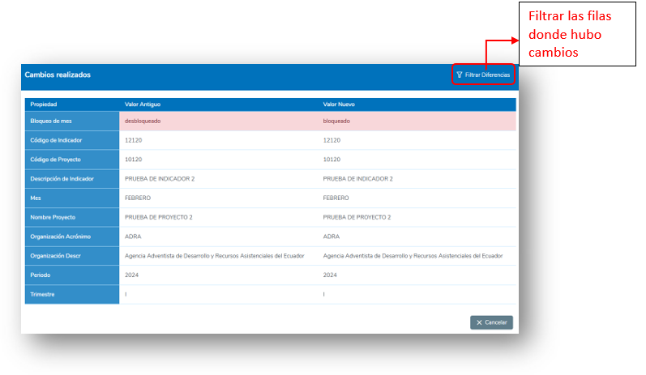

## 5.7.4 Auditoría de Bloqueo de Mes Masivo
En Auditoría de Bloqueo de Mes masivo se permitirá al usuario revisar un registro detallado de los bloqueos o desbloqueos de mes masivo en los indicadores de Ejecución de proyectos.

### Estructura de la Tabla de Auditoría de Bloqueo de Mes Indicador
La tabla de auditoría incluye las siguientes columnas:

- **Tabla**: Nombre de la tabla en la que se realizó la auditoría.
- **Código de Proyecto**: Identificador único del proyecto relacionado con el bloqueo masivo.
- **Acción**: Describe la acción realizada, que puede ser:
  - LOCK: Se bloqueó un reporte de mes.
  - UNLOCK: Se desbloqueó un reporte de mes.
- **Usuario**: Nombre del usuario que realizó la modificación.
- **Fecha de Cambio**: Fecha y hora exacta en que se ejecutó la modificación.

  

### Consultar Bloqueos Realizados
Para revisar los bloqueos de mes realizados por indicador:

1. **Acceder a la Sección de Auditoría**
   - Navegar a la sección de Auditoría dentro del sistema.
   - En la parte superior de la tabla, localice el campo de selección denominado "Auditoría".

2. **Seleccionar la Opción "Bloqueo de Mes Masivo"**
   - En el campo de selección, elija la opción "Bloqueo de Mes Masivo" para filtrar los registros relacionados con modificaciones realizadas en los bloqueos masivos de mes.

3. **Buscar y Visualizar Cambios Específicos**
   - Utilice los filtros disponibles en las columnas de la tabla para buscar el registro deseado (por ejemplo, por código de proyecto o fecha de cambio).
   - Identifique el registro de interés y haga clic en el botón "Ver cambios", ubicado en la última columna correspondiente al registro seleccionado.

  

### Ventana de Cambios Realizados
La Ventana de Cambios proporciona una vista detallada de las modificaciones efectuadas en un indicador de reporte. Esta funcionalidad permite analizar de forma clara y precisa los valores antiguos y nuevos de cada campo.

#### Características de la Ventana de Cambios
1. **Visualización de Cambios**
   - La ventana presenta una tabla con dos columnas principales:
     - **Valores Antiguos**: Muestra el estado previo de cada campo.
     - **Valores Nuevos**: Indica los datos actualizados tras la modificación.
   - Las filas que contienen cambios se resaltan en rojo, facilitando su identificación rápida, para este caso la fila de Bloqueo de Mes que es el campo que cambia en esta tabla.

2. **Número de Tablas por Ventana de Cambio**
   - En la ventana de cambios aparecerá una tabla por

3. **Valores Inexistentes o Nuevos**
   - Si un campo no tiene un valor previo registrado, la columna de Valores Antiguos mostrará "N/A".
   - Esto indica que el reporte se realizó por primera vez durante la modificación.

  

## 5.7.5 Exportar Auditorías

Para poder exportar la tabla de auditorías existentes en el sistema, se deberá dirigir a la parte superior de la pantalla de Auditorías y dar clic sobre el botón de **“Exportar”**.
Inmediatamente se empezará a descargar un archivo en formato Excel con la información de la tabla.

Si la tabla se encontraba con algún filtro aplicado, se exportarán los registros de auditorías que aparecen con este filtro.

  

## 5.8 Catálogo de Indicadores

En la sección de **Catálogo de Indicadores** se podrá crear, consultar, y modificar la información de los **Indicadores de Producto** del sistema.

Para acceder a los Indicadores de Producto se debe dar clic en el menú en la sección de **“Administración”**, luego en la opción de **“Indicadores de Producto”** y por último dar clic sobre la opción de **Catálogo de Indicadores**.

  
  

Dentro de la pantalla de **Catálogo de Indicadores** tenemos en la parte superior derecha 3 botones los cuales permiten al usuario:
- Crear nuevos Indicadores de Producto.
- Importar Indicadores de Producto.
- Exportar la información de la tabla a un archivo tipo **“.xls”**.

### 5.8.1 Crear nuevo Indicador de Producto

Para crear un nuevo Indicador de Producto se deberá dirigir a los botones de la parte superior derecha de la pantalla de Indicadores de Producto y presionar sobre el botón de **“Crear”**. A continuación, se desplegará un formulario el cual se deberá completar con cada uno de los campos que se presenten. Por último, se deberá presionar sobre el botón **“Guardar”** para crear un nuevo Indicador de Producto o en **“Cancelar”** si no se desea hacerlo.

Se debe completar cada uno de los campos del formulario para que el botón de **“Guardar”** se habilite.

**Campos de Ingreso:**
- **Core Indicator**: Esta opción permite crear un nuevo indicador basado en un indicador núcleo preestablecido. Al marcar la casilla de verificación se habilitará un campo de selección para elegir un Core Indicator. Una vez seleccionado, los campos de **Código Regional**, **Tipo de Medida**, **Frecuencia de Alerta** y **Descripción Completa** se completarán automáticamente. Además, estos campos, junto con los campos de **Instrucciones**, quedarán deshabilitados para su edición.
- **Enunciado**: Enunciado del indicador, una vez elegido permitirá escoger las desagregaciones para el periodo correspondiente del enunciado.
- **Código**: Código identificador del Indicador.
- **Descripción completa**: Descripción detallada del Indicador.
- **Categoría**: Categoría del Indicador de Producto, este campo se puede dejar en blanco.
- **Tipo de Medida**: Tipo de medición que tendrá el Indicador, esta puede ser **(Número enteros, Proporción, Texto)**.
- **Frecuencia de alerta**: Frecuencia con la que se envían correos de alerta esta puede ser **(Mensual, Trimestral, Semestral, Anual)**.
- **Unidad de medida**: Unidad de Medida del Indicador estas pueden ser **(Personas de interés, Personas, Organizaciones o instituciones, Transferencias, Otro, Hogares)**.
- **Result Manager**: Funcionario de ACNUR responsable de verificar los datos de reporte para ese indicador.
- **Bloqueo automático**: Bloquear el indicador para reporte después de guardar.
- **Estado**: El estado del indicador este puede ser **“Activo”** o **“Inactivo”**.
- **Instrucciones para Información Cuantitativa**: Instrucciones detalladas para el ingreso de información cuantitativa, este campo puede dejarse en blanco.
- **Desagregaciones**: Desagregaciones que se utilizarán para el reporte del indicador, se pueden escoger entre **Desagregaciones Estándar** y **Desagregaciones Personalizadas**.

  

Si el usuario escoge la opción de **“Personas de Interés”** en el campo de **Unidad de Medida**, se presentará una etiqueta indicando que se debe desagregar por **“Tipo de población”** dentro de cada año.

  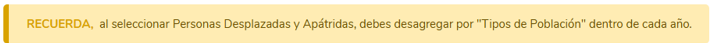

De no escoger **“Tipo de población”** como desagregación al querer guardar se presentará una ventana de confirmación no restrictiva volviendo a indicar que no se ha escogido **“Tipo de población”** como opción de desagregación, el usuario podrá guardar de todas formas si así lo desea o cancelar para seguir editando.

  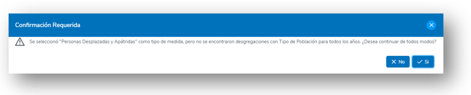

### 5.8.2 Tabla de Catálogo de Indicadores

Dentro de la pantalla de **Catálogo de Indicadores** podremos observar una tabla de los registros de todos los Indicadores de Producto que se hayan creado en el sistema, estos registros aparecerán con las columnas de información más relevantes. En caso de querer mostrar otra columna, el usuario podrá hacer clic en la parte superior de la tabla y seleccionar las columnas de información que requiere mostrar.

  

En cada columna de la tabla, el usuario podrá aplicar un filtro para poder buscar algún registro en específico, estos filtros pueden aplicarse de manera simultánea si se quieren colocar más de uno. Para eliminar el filtro el usuario puede dar clic en el ícono de filtro que se encuentra a lado del campo.

  

El usuario también podrá ordenar de manera ascendente o descendente los registros de la tabla por una columna específica dando un clic en el nombre de la columna que desea ordenar de manera ascendente y dando otro clic adicional para ordenar de manera descendente.

  

### 5.8.3 Edición de Indicadores de Producto

Para editar un Indicador de Producto, se debe dirigir a la tabla de Indicadores de Producto, encontrar el registro de Indicador de Producto que se desea modificar y hacer clic en el ícono de lápiz ubicado en la última columna.

  

En la pantalla que se despliega se mostrará un formulario con toda la información actual del Indicador de Producto. Una vez realizada la modificación se tendrá que hacer clic sobre el botón de **“Guardar”**, caso contrario se puede hacer clic en el botón de **“Cancelar”** si no se requiere realizar ningún cambio.

Una vez guardado los cambios aparecerá un mensaje de **guardado exitoso**.

  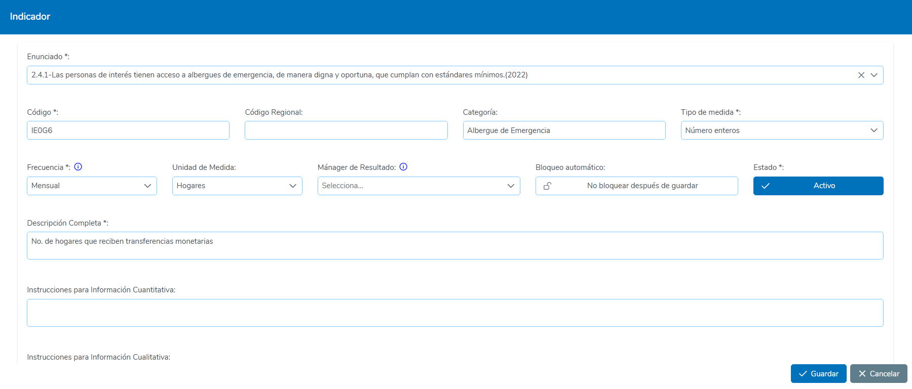
  

### 5.8.4 Importar Indicador de Producto

El sistema permite importar indicadores de producto utilizando una plantilla de Excel, lo que facilita la creación masiva de indicadores en lugar de configurarlos manualmente. Se deben seguir los pasos a continuación para completar la importación:

**Pasos para Importar un Indicador de Producto:**
1. **Acceder a la Función de Importación**
   - En la pantalla de Administración de Indicadores de Producto, dar clic en el botón **"Importar"**.
2. **Descargar la Plantilla**
   - Si no se dispone de la plantilla de importación, dar clic en **"Descargar la Plantilla"** para obtener el archivo base.
3. **Completar la Plantilla de Excel**
   - Abrir la plantilla descargada y completar cada columna con la información correspondiente para el nuevo indicador de producto. Asegurarse de llenar los campos obligatorios según las especificaciones del sistema.
4. **Subir la Plantilla al Sistema**
   - Una vez completada la plantilla, regrese a la pantalla de importación en el sistema.
   - Dar clic en **"Seleccionar Archivo"** y elegir la plantilla que contiene los indicadores a importar.
5. **Seleccionar el Período**
   - Antes de guardar, seleccionar el período al que pertenecerá el indicador de producto que está importando.
6. **Guardar la Importación**
   - Dar clic en el botón **"Guardar"** para finalizar el proceso de importación.

  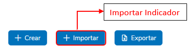
  
  

### 5.8.5 Deshabilitar Indicadores de Producto

Para deshabilitar un Indicador de Producto y dejarlo completamente inactivo, de manera que no pueda ser asignado a ningún otro bloque de operación, se deberá seguir los siguientes pasos:

1. **Acceder a la Tabla de Indicadores de Producto**: Ingresar al módulo correspondiente y localizar la Tabla de Indicadores de Producto. Identificar el Indicador de Producto que se desea deshabilitar.
2. **Editar el Indicador de Producto**: Dar clic en el ícono de lápiz ubicado en la fila del Indicador de Producto que desea inhabilitar. Esto abrirá el formulario de edición del Indicador de Producto.
3. **Cambiar el Estado a "Inactivo"**: En el formulario de edición, localizar el campo **"Estado"** y cambiar su valor a **"Inactivo"**.
4. **Guardar los Cambios**: Una vez actualizado el estado, dar clic en el botón **"Guardar"** para confirmar la modificación.
5. **Confirmación de guardado**: El sistema mostrará un mensaje de confirmación indicando que los datos han sido guardados exitosamente. A partir de este momento, el Indicador de Producto estará completamente inhabilitado para asignación en cualquier bloque de operación.

  
  

### 5.8.6 Exportar Indicadores de Producto

Para poder exportar la tabla de Indicadores de Producto existentes en el sistema se deberá dirigir a la parte superior de la pantalla de Indicadores de Producto y dar clic sobre el botón de **“Exportar”**.

Inmediatamente se empezará a descargar un archivo en formato Excel con la información de la tabla.

Si la tabla se encontraba con algún filtro aplicado se exportarán los registros de Indicadores de Producto que aparecen con este filtro.

  

# 5.9 Proyectos

En la sección de proyectos se podrá crear, consultar y modificar la información de los proyectos del sistema.  
Para acceder a los Proyectos se debe dar clic en el menú en la sección de “Administración”, luego en la opción de “Indicadores de Producto” y por último dar clic sobre la opción de **Indicadores Socios**.

  

Dentro de la pantalla de proyectos tenemos en la parte superior un campo de selección y dos botones, los cuales permiten al usuario:  
- Seleccionar el **Periodo** para mostrar el listado de proyectos pertenecientes al mismo y crear nuevos en el periodo seleccionado.  
- **Crear nuevos proyectos**  
- **Exportar** la información de la tabla a un archivo tipo “.xls”.

  

## 5.9.1 Crear nuevo Proyecto

Para crear un nuevo proyecto se deberá dirigir a los botones de la parte superior derecha de la pantalla de Proyectos y presionar sobre el botón de **“Crear”**, a continuación, se abrirá una pantalla en la cual se deberá completar con cada uno de los campos que se presenten. Por último, se deberá presionar sobre el botón **“Guardar”** para crear un nuevo proyecto o en **“Cancelar”** si no se desea hacerlo.  
Se debe completar primero cada uno de los campos de la primera sección para que el botón de **“Guardar”** se habilite.  

### Campos de la primera sección:
- **Número de Acuerdo**: Código del proyecto.
- **Nombre del Acuerdo**: Nombre del proyecto.
- **Estado**: El estado del proyecto este puede ser “Activo” o “Inactivo”.
- **Socio**: Socio implementador del proyecto.
- **Año de Implementación**: Periodo en el cual el proyecto será implementado, esta opción se completa automáticamente al seleccionar el periodo en la tabla de Administración de proyectos.
- **Fecha de Inicio de Implementación**: Fecha de Inicio del proyecto.
- **Fecha de fin de Implementación**: Fecha de fin del proyecto.
- **Puntos focales ACNUR de Proyecto**: Usuarios de ACNUR a cargo del monitoreo proyecto.
- **Partner Manager**: Usuario de la Organización Implementadora encargada del reporte del proyecto.
- **Lugares de Ejecución**: Lugares en los cuales se implementará el proyecto.

  

Una vez completada la información de la primera sección se deberá hacer clic en el botón **“Guardar”**.  
A continuación, aparecerá un mensaje y una alerta que nos indica que el proyecto no tiene asignado todavía ningún indicador de producto, lo cual se deberá hacer a continuación completando los campos de la segunda sección.

  

### Campos de la segunda sección:
- **Indicador General**: Indicador general para el proyecto, este aplica si el periodo o año de implementación del proyecto tiene un indicador general.
- **Indicador de producto**: Indicadores de producto que tendrá el proyecto. Para agregar los indicadores se deberá hacer clic en el botón **“Agregar un Indicador”** y completar el siguiente formulario:
    - **Indicador**: Indicador de producto que será asignado al proyecto.
    - **Indicador Prestado**: Señala si el Indicador es prestado o no.
    - **Enunciado para el proyecto**: Enunciado correspondiente al indicador seleccionado (Este campo se completa solo y no se puede editar).
    - **Estado**: El estado del proyecto este puede ser “Activo” o “Inactivo”.
    - **Lugares de Ejecución**: Lugares en los que el Indicador se implementará, por defecto aparecerán todos los lugares que se asignaron al proyecto, aquí se podrán desactivar los que no se deseen colocar para el Indicador.

  

Una vez completado el formulario de **Indicador de producto**, dar clic en el botón de **“Guardar”**, seguidamente al hacer esto aparecerá una ventana para establecer la meta del Indicador, aquí se deberá colocar un valor numérico y después dar clic en **“Guardar”**.

  

### Importar Indicadores
En la creación y edición de proyectos también se podrá importar los indicadores mediante una plantilla, para esto se deberá presionar sobre el botón **“Importar indicadores”** en la parte inferior, luego dar clic en **Descargar la plantilla**.  
Cuando se tenga completa la plantilla en Excel, dar clic en **“Seleccionar archivo”** y luego dar clic en **“Guardar”**.

  

## 5.9.2 Tabla de Proyectos

Dentro de la pantalla de Proyectos podremos observar una tabla de los registros de todos los proyectos que se hayan creado en el sistema, estos registros aparecerán con las columnas de información más relevantes. En caso de querer mostrar otra columna, el usuario podrá hacer clic en la parte superior de la tabla y seleccionar las columnas de información que requiere mostrar.

  

En cada columna de la tabla el usuario podrá aplicar un filtro para poder buscar algún registro en específico. Estos filtros pueden aplicarse de manera simultánea si se quieren colocar más de uno.  
Para eliminar el filtro el usuario puede dar clic en el ícono de filtro que se encuentra a lado del campo.

  

El usuario también podrá ordenar de manera ascendente o descendente los registros de la tabla por una columna específica dando un clic en el nombre de la columna que desea ordenar de manera ascendente y dando otro clic adicional para ordenar de manera descendente.

  

## 5.9.3 Edición de Proyectos

Para editar un proyecto, se debe dirigir a la tabla de proyectos, encontrar el registro de proyecto que se desea modificar y hacer clic en el ícono de lápiz ubicado en la última columna.

  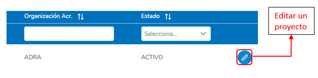

En la pantalla que se despliega se mostrará un formulario con toda la información actual del proyecto. Una vez realizada la modificación, se tendrá que hacer clic sobre el botón **“Guardar”**, caso contrario se puede hacer clic en el botón de **“Cancelar”** si no se requiere realizar ningún cambio.

  

Una vez guardado los cambios, aparecerá un mensaje de **guardado exitoso**.

  

### Editar indicadores
Para editar los indicadores se debe ir a la sección inferior y dar clic en el botón de **“editar indicador sobre la fila del Indicador que se desea editar”**, de igual manera si se requiere editar las metas del indicador, se deberá hacer clic en el botón de **“actualizar metas”**.

  

## 5.9.4 Deshabilitar Proyectos

Para deshabilitar un proyecto y dejarlo completamente inactivo, de manera que no pueda ser asignado a ningún otro bloque de operación, se deberá seguir los siguientes pasos:

1. **Acceder a la Tabla de Proyectos**: Ingresar al módulo correspondiente y localizar la Tabla de Proyectos. Identificar el proyecto que se desea deshabilitar.
2. **Editar el Proyecto**: Dar clic en el ícono de lápiz ubicado en la fila del proyecto que desea inhabilitar. Esto abrirá el formulario de edición del proyecto.
3. **Cambiar el Estado a "Inactivo"**: En el formulario de edición, localizar el campo "Estado" y cambiar su valor a "Inactivo".
4. **Guardar los Cambios**: Una vez actualizado el estado, dar clic en el botón **"Guardar"** para confirmar la modificación.
5. **Confirmación de guardado**: El sistema mostrará un mensaje de confirmación indicando que los datos han sido guardados exitosamente. A partir de este momento, el proyecto estará completamente inhabilitado para asignación en cualquier bloque de operación.

  
  

## 5.9.5 Exportar Proyectos

Para poder exportar la tabla de proyectos existentes en el sistema se deberá dirigir a la parte superior de la pantalla de Proyectos y dar clic sobre el botón **“Exportar”**.  
Inmediatamente se empezará a descargar un archivo en formato **Excel** con la información de la tabla.  
Si la tabla se encontraba con algún filtro aplicado, se exportarán los registros de proyectos que aparecen con este filtro.

  

# 5.10 Implementación directa

En la sección de **implementación directa** se podrá crear, consultar y modificar la información de las implementaciones directas del sistema.  
Para acceder a las **Implementaciones directas** se debe dar clic en el menú en la sección de **“Administración”**, luego en la opción de **Implementación directa**.

  

Dentro de la pantalla de implementaciones directas tenemos en la parte superior un campo de selección y tres botones, los cuales permiten al usuario:  
- Seleccionar el **Periodo** para mostrar el listado de implementaciones pertenecientes al mismo y crear nuevas en el periodo seleccionado.  
- **Crear nuevas implementaciones directas**  
- **Importar Implementaciones**  
- **Exportar** la información de la tabla a un archivo tipo “.xls”.

  

## 5.10.1 Crear nueva Implementación directa

Para crear una nueva implementación directa, se deberá dirigir a los botones de la parte superior derecha de la pantalla de **Implementaciones directas** y presionar sobre el botón **“Crear”**, a continuación, se desplegará un formulario el cual se deberá completar con cada uno de los campos que se presenten. Por último, se deberá presionar sobre el botón **“Guardar”** para crear una nueva implementación directa o en **“Cancelar”** si no se desea hacerlo.  
Se debe completar cada uno de los campos del formulario para que el botón de **“Guardar”** se habilite.

### Campos de Ingreso:
- **Oficina Responsable**: Oficina responsable de la implementación.
- **Indicador**: Indicador que se utilizará para la implementación directa.
- **Enunciado de Producto**: Enunciado correspondiente al Indicador seleccionado, este campo se completa automáticamente al elegir un indicador y no es editable.
- **Código de Producto**: Código correspondiente al Indicador seleccionado, este campo se completa automáticamente al elegir un indicador y no es editable.
- **Meta Anual**: Meta total anual del Indicador.
- **Manager de Resultados**: Supervisor a cargo de la revisión de la Implementación.
- **Responsable de Reporte ANUR**: Responsable a cargo del reporte del Indicador.
- **Responsable de Reporte ACNUR Alterno**: Responsable alterno a cargo del reporte del Indicador, este campo puede dejarse en blanco.
- **Estado**: El estado de la implementación directa puede ser “Activo” o “Inactivo”.

  
  

## 5.10.2 Tabla de Implementaciones directas

Dentro de la pantalla de **Implementaciones directas** podremos observar una tabla de los registros de todas las implementaciones directas que se hayan creado en el sistema, estos registros aparecerán con las columnas de información más relevantes. En caso de querer mostrar otra columna, el usuario podrá hacer clic en la parte superior de la tabla y seleccionar las columnas de información que requiere mostrar.

  

En cada columna de la tabla el usuario podrá aplicar un filtro para poder buscar algún registro en específico. Estos filtros pueden aplicarse de manera simultánea si se quieren colocar más de uno.  
Para eliminar el filtro, el usuario puede dar clic en el ícono de filtro que se encuentra a lado del campo.

  

El usuario también podrá ordenar de manera ascendente o descendente los registros de la tabla por una columna específica dando un clic en el nombre de la columna que desea ordenar de manera ascendente y dando otro clic adicional para ordenar de manera descendente.

  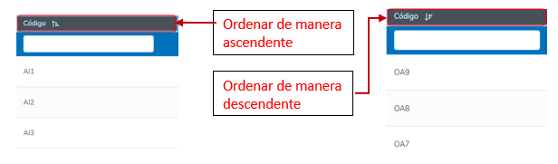

## 5.10.3 Edición de Implementación directa

Para editar una implementación directa, se debe dirigir a la tabla de **implementaciones directas**, encontrar el registro de implementación directa que se desea modificar y hacer clic en el ícono de lápiz ubicado en la última columna.

  

En la pantalla que se despliega se mostrará un formulario con toda la información actual de la implementación directa. Una vez realizada la modificación, se tendrá que hacer clic sobre el botón **“Guardar”**, caso contrario se puede hacer clic en el botón de **“Cancelar”** si no se requiere realizar ningún cambio.  

Una vez guardado los cambios, aparecerá un mensaje de **guardado exitoso**.

  
  

## 5.10.4 Deshabilitar Implementaciones directas

Para deshabilitar una implementación directa y dejarla completamente inactiva, de manera que no pueda ser asignada a ningún otro bloque de operación, se deberá seguir los siguientes pasos:

1. **Acceder a la Tabla de Implementaciones directas**: Ingresar al módulo correspondiente y localizar la Tabla de Implementaciones directas. Identificar la implementación directa que se desea deshabilitar.
2. **Editar la Implementación directa**: Dar clic en el ícono de lápiz ubicado en la fila de la implementación directa que desea inhabilitar. Esto abrirá el formulario de edición de la implementación directa.
3. **Cambiar el Estado a "Inactivo"**: En el formulario de edición, localizar el campo "Estado" y cambiar su valor a "Inactivo".
4. **Guardar los Cambios**: Una vez actualizado el estado, dar clic en el botón **"Guardar"** para confirmar la modificación.
5. **Confirmación de guardado**: El sistema mostrará un mensaje de confirmación indicando que los datos han sido guardados exitosamente. A partir de este momento, la implementación directa estará completamente inhabilitada para asignación en cualquier bloque de operación.

  

## 5.10.5 Importar Implementación directa

El sistema permite importar implementaciones directas utilizando una plantilla de **Excel**, lo que facilita la creación masiva de implementaciones en lugar de configurarlos manualmente. Se deben seguir los pasos a continuación para completar la importación:

### Pasos para Importar una Implementación Directa

1. **Acceder a la Función de Importación**  
    En la pantalla de **Administración de Implementación directa** dar clic en el botón **"Importar"**.
2. **Seleccionar el Período**  
    Seleccionar el período al que pertenecerá la implementación directa que se está importando.
3. **Seleccionar la Oficina**  
    Seleccionar la oficina que estará a cargo de la implementación directa.
4. **Descargar la Plantilla**  
    Dar clic en **"Descargar Plantilla"** para obtener el archivo base, con las opciones del período y oficina previamente seleccionados.
5. **Completar la Plantilla de Excel**  
    Abrir la plantilla descargada y completar cada columna con la información correspondiente para el nuevo indicador de producto. Asegurarse de llenar los campos obligatorios según las especificaciones del sistema.
6. **Subir la Plantilla al Sistema**  
    Una vez completada la plantilla, regrese a la pantalla de importación en el sistema.  
    Dar clic en **"Seleccionar Archivo"** y elegir la plantilla que contiene las implementaciones a importar.
7. **Guardar la Importación**  
    Dar clic en el botón **"Guardar"** para finalizar el proceso de importación.

  
  

## 5.10.6 Exportar Implementaciones directas

Para poder exportar la tabla de **implementaciones directas** existentes en el sistema se deberá dirigir a la parte superior de la pantalla de **Implementaciones directas** y dar clic sobre el botón **“Exportar”**.  
Inmediatamente se empezará a descargar un archivo en formato **Excel** con la información de la tabla.  
Si la tabla se encontraba con algún filtro aplicado, se exportarán los registros de implementaciones directas que aparecen con este filtro.

  

# 5.11 Envío Masivo de Correos

En esta sección, el Usuario podrá enviar distintos tipos de correos de manera simultánea a los demás usuarios participantes de los bloques de implementación.  
Para ingresar a la **Pantalla de Envío Masivo de Correos**, el usuario deberá dirigirse a la sección de **Administración**, luego dar clic sobre la opción de **“Bloqueo Masivo de Indicadores”**.

  

## 5.11.1 Envío de Recordatorios

La funcionalidad de **envío de recordatorios** permite al usuario enviar correos masivos a socios o colegas implementadores con el propósito de recordarles la necesidad de realizar los reportes correspondientes.  
El sistema ofrece dos tipos de recordatorios:

- **Recordatorio de Reporte de Socios**:  
  Envía un correo de recordatorio a todos los Socios Implementadores para que completen y envíen los reportes requeridos.
  
- **Recordatorio de Reporte a Colegas de Implementación Directa**:  
  Envía un correo de recordatorio a todos los colegas que participan en la Implementación Directa, para que realicen sus reportes correspondientes.

### Pasos para Enviar los Recordatorios

1. **Seleccionar el Año de las Actividades**:  
   En la pantalla de envío masivo de correos, ubique el campo de selección de año y elija el período correspondiente a las actividades.
   
2. **Elegir el Tipo de Recordatorio**:  
   En la sección de Recordatorios, identifique la opción de recordatorio que desea enviar:
   - Recordatorio de Reporte de Socios
   - Recordatorio de Reporte a Colegas de Implementación Directa
   
3. **Enviar el Correo**:  
   Haga clic en el botón asociado al tipo de recordatorio seleccionado.

  

## 5.11.2 Envío de Alertas de Retrasos

La funcionalidad de **envío de alertas** permite al usuario enviar correos masivos a socios o colegas implementadores con el propósito de alertarlos sobre los indicadores de reporte que se encuentran con retraso.  
El sistema ofrece dos tipos de alertas:

- **Alerta de Retrasos de Socios**:  
  Envía un correo de alertas a todos los Socios Implementadores para que completen y envíen los reportes requeridos.

- **Alerta de Retrasos a Colegas de Implementación Directa**:  
  Envía un correo de recordatorio a todos los colegas que participan en la Implementación Directa, para que realicen sus reportes correspondientes.

### Pasos para Enviar las Alertas

1. **Seleccionar el Año de las Actividades**:  
   En la pantalla de envío masivo de correos, ubique el campo de selección de año y elija el período correspondiente a las actividades.
   
2. **Elegir el Tipo de Alerta**:  
   En la sección de Recordatorios, identifique la opción de alerta que desea enviar:
   - Alerta de Reporte de Socios
   - Alerta de Reporte a Colegas de Implementación Directa
   
3. **Enviar el Correo**:  
   Haga clic en el botón asociado al tipo de alerta seleccionada.

  

# 5.12 Bloqueo Masivo de Indicadores

La funcionalidad de **bloqueo masivo de indicadores** permite al usuario restringir o habilitar la capacidad de realizar reportes sobre indicadores en un mes y año específicos. Esta herramienta es útil para gestionar los períodos de reporte y garantizar que los datos ingresados cumplan con las fechas establecidas.  
Para ir a esta sección, el usuario deberá dirigirse al menú de **Administración** y luego dar clic sobre la opción de **“Bloqueo Masivo de Indicadores”**.

  

## 5.12.1 Bloquear Indicadores

La funcionalidad de **bloqueo de indicadores** permite al usuario deshabilitar la opción de reporte para todos los indicadores en un mes específico, asegurando que no se realicen modificaciones fuera de los períodos autorizados.

### Pasos para Bloquear Indicadores

1. **Seleccionar el Año**:  
   - En la pantalla de Bloqueo Masivo de Indicadores, ubique el campo de selección de año.  
   - Elija el año correspondiente a las actividades en las que desea realizar el bloqueo.

2. **Acceder a la Sección de Bloqueo**:  
   - Diríjase a la sección **"Bloquear"** en la interfaz de la funcionalidad.

3. **Bloquear el Mes Deseado**:  
   - Identifique el mes que desea bloquear en la lista desplegada.  
   - Haga clic en el botón correspondiente al mes seleccionado.

4. **Confirmación del Bloqueo**:  
   - Una vez realizada la acción, el sistema mostrará un mensaje de confirmación indicando que el mes ha sido bloqueado exitosamente.

  

## 5.12.2 Desbloquear Indicadores

La funcionalidad de **desbloqueo de indicadores** permite al usuario habilitar la opción de reporte para todos los indicadores en un mes específico.

### Pasos para Desbloquear Indicadores

1. **Seleccionar el Año**:  
   - En la pantalla de Bloqueo Masivo de Indicadores, ubique el campo de selección de año.  
   - Elija el año correspondiente a las actividades en las que desea realizar el desbloqueo.

2. **Acceder a la Sección de Desbloqueo**:  
   - Diríjase a la sección **"Desbloquear"** en la interfaz de la funcionalidad.

3. **Desbloquear el Mes Deseado**:  
   - Identifique el mes que desea desbloquear en la lista desplegada.  
   - Haga clic en el botón correspondiente al mes seleccionado.

4. **Confirmación del Desbloqueo**:  
   - Una vez realizada la acción, el sistema mostrará un mensaje de confirmación indicando que el mes ha sido desbloqueado exitosamente.

  

# 5.13 Menús de Tableros

En esta sección, el Usuario podrá crear menús dinámicos generalmente para colocar **Dashboards informativos** de las operaciones y actividades, además de asignar permisos de acceso a los mismos.  
Para acceder a esta pantalla, el usuario deberá dirigirse a la sección de **“Administración”** y luego dar clic sobre la opción **“Menús de Tableros”**.

  

Dentro de la pantalla de menús, en la parte superior derecha, se encuentran **2 botones** que permiten al usuario:  
- Crear nuevos menús  
- Exportar la información de la tabla a un archivo tipo **“.xls”**.

  

## 5.13.1 Crear nuevo Menú

Para crear un nuevo menú, se deberá dirigir a los botones de la parte superior derecha de la pantalla de Menús y presionar sobre el botón de **“Crear”**. A continuación, se desplegará un formulario el cual se deberá completar con cada uno de los campos que se presenten. Por último, se deberá presionar sobre el botón **“Guardar”** para crear un nuevo menú o en **“Cancelar”** si no se desea hacerlo.  
Se debe completar cada uno de los campos del formulario para que el botón de **“Guardar”** se habilite.

### Campos de Ingreso:
- **Etiqueta**: Nombre del menú.
- **Padre**: Menú Padre del cual se derivará el nuevo; esta opción se puede dejar en blanco si no se desea agregar uno.
- **Ícono**: Ícono que aparecerá junto al nombre del menú; este debe ser tomado desde la página de **PrimeNG** Versión 14. La estructura que se deberá seguir es la siguiente: **pi (nombre del ícono)**. Se debe colocar la palabra **pi** y después de un espacio el nombre del ícono.  
  Ejemplos:  
  - `pi pi-user`  
  - `pi pi-bars`  
  - `pi pi-folder`
  

  

  
- **Roles**: Roles de los usuarios que tendrán acceso al menú.
- **Url**: Url del Dashboard que se desea visualizar.
- **Estado**: Estado del Menú (puede ser **Activo** o **Inactivo**).
- **Orden**: Orden en el que se presentará el menú, si hay varios en la misma jerarquía.
- **Es PowerBi**: Indica si el Dashboard es de PowerBi.
- **Acceso Restringido**: Restringe el acceso únicamente a los socios Implementadores que se desea dar permiso. Cuando esta opción se activa, se presenta una lista de los nombres de los Implementadores para que se puedan escoger únicamente los que tendrán acceso al menú.

  

Al crear el menú, este aparecerá en la parte final del menú principal y, si tiene un menú padre, se colocará debajo del mismo.

  

## 5.13.2 Tabla de Menús

Dentro de la pantalla de Menús, se podrá observar una tabla con los registros de menús que se hayan creado en el sistema. Estos registros aparecerán con las columnas de información más relevantes. En caso de querer mostrar otra columna, el usuario podrá hacer clic en la parte superior de la tabla y seleccionar las columnas de información que requiere mostrar.

  

En cada columna de la tabla, el usuario podrá aplicar un filtro para buscar un registro específico. Estos filtros pueden aplicarse de manera simultánea si se desean colocar más de uno. Para eliminar el filtro, el usuario puede dar clic en el ícono de filtro que se encuentra a lado del campo.

  

El usuario también podrá ordenar de manera ascendente o descendente los registros de la tabla por una columna específica dando un clic en el nombre de la columna que desea ordenar de manera ascendente y dando otro clic adicional para ordenar de manera descendente.

  

## 5.13.3 Edición de Menús

Para editar un menú, se debe dirigir a la tabla de menús, encontrar el registro de menú que se desea modificar y hacer clic en el ícono de **lápiz** ubicado en la última columna.

  

En la pantalla que se despliega se mostrará un formulario con toda la información actual del menú. Una vez realizada la modificación, se tendrá que hacer clic sobre el botón **“Guardar”**, o en **“Cancelar”** si no se desea realizar ningún cambio.  
Una vez guardado los cambios, aparecerá un mensaje de guardado exitoso.

  
  

## 5.13.4 Deshabilitar Menús

Para deshabilitar un menú y dejarlo completamente inactivo, de manera que no pueda ser asignado a ningún otro bloque de operación, se deberá seguir los siguientes pasos:

1. **Acceder a la Tabla de Menús**:  
   Ingresar al módulo correspondiente y localizar la **Tabla de Menús**. Identificar el menú que se desea deshabilitar.

2. **Editar el Menú**:  
   Dar clic en el ícono de **lápiz** ubicado en la fila del menú que desea inhabilitar. Esto abrirá el formulario de edición del menú.

3. **Cambiar el Estado a "Inactivo"**:  
   En el formulario de edición, localizar el campo **"Estado"** y cambiar su valor a **"Inactivo"**.

4. **Guardar los Cambios**:  
   Una vez actualizado el estado, dar clic en el botón **"Guardar"** para confirmar la modificación.

5. **Confirmación de Guardado**:  
   El sistema mostrará un mensaje de confirmación indicando que los datos han sido guardados exitosamente. A partir de este momento, el menú estará completamente inhabilitado para asignación en cualquier bloque de operación.

  
  

## 5.13.5 Exportar Menús

Para exportar la tabla de menús existentes en el sistema, se deberá dirigirse a la parte superior de la pantalla de Menús y dar clic sobre el botón con el ícono de **documento**.  
Inmediatamente se empezará a descargar un archivo en formato **Excel** con la información de la tabla.  
Si la tabla se encontraba con algún filtro aplicado, se exportarán los registros de menús que aparecen con este filtro.

  

