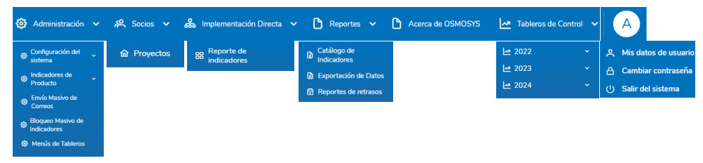

## 3. ESTRUCTURA DEL SISTEMA

### 3.1 Menú principal
El menú principal incluye las siguientes secciones:

- **Home**: Acceso rápido a Dashboard general de Proyectos, Implementación Directa, Indicadores de producto.
- **Administración**: Configuración, creación, y edición de los diferentes Bloques de Gestión y Monitoreo.
- **Socios**: Monitoreo de proyectos.
- **Implementación directa**: Monitoreo de indicadores para implementación directa.
- **Reportes**: Catálogo de indicadores, Exportación de datos y Reportes de retrasos.
- **Acerca de Osmosys**: Sección descriptiva de la historia, propósito y funcionalidades del sistema de Osmosys.
- **Tableros de Control**: Menú dinámico que los usuarios pueden controlar y cambiar a su disposición, generalmente utilizado para la visualización de dashboards informativos para el monitoreo de las actividades.
- **Perfil de Usuario**: Información del usuario, cambio de contraseña, cierre de sesión.

  

