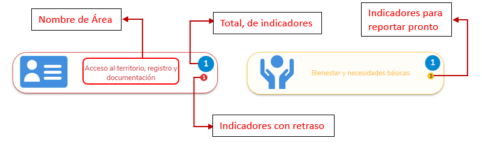
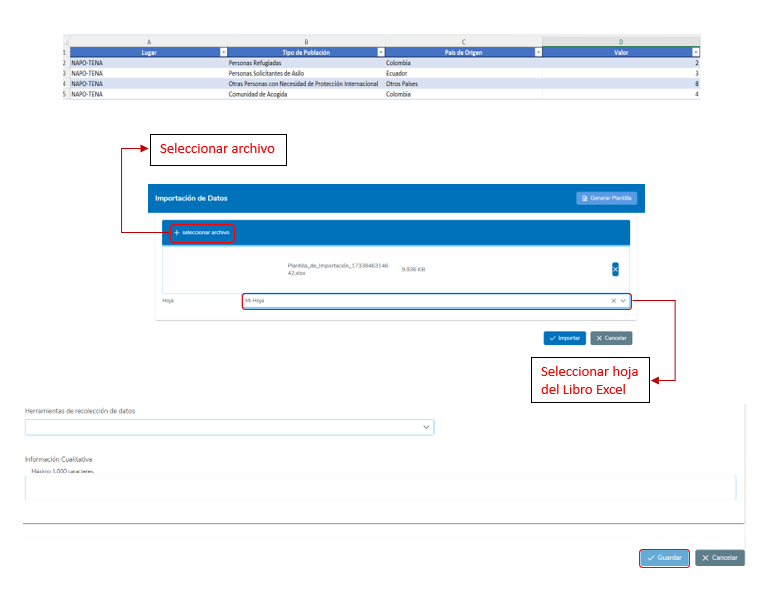

## 7 IMPLEMENTACIÓN DIRECTA

En la sección de **Implementación Directa**, el usuario podrá realizar el monitoreo y reporte de valores referentes a los indicadores asignados a los usuarios responsables de ACNUR correspondientes.

### 7.1 Reporte de Indicadores

Para acceder a la pantalla de **Reporte de Indicadores**, se debe dar clic en el menú en la sección de **“Socios”**, luego dar clic sobre la opción de **Proyectos**.

  

En la pantalla de Implementación Directa, el usuario cuenta con herramientas de búsqueda y filtrado para localizar indicadores relacionados con estos campos. Los indicadores están organizados por **Áreas** para facilitar la navegación y gestión de los datos.

### Campos de Selección Disponibles

En la parte superior de la pantalla, se encuentran varios campos de selección que permiten aplicar filtros según diferentes criterios. Estos son:

- **Periodo**
- **Oficina**
- **Usuario**
- **Roles**

  

Cuando se modifica algún campo de selección en la pantalla de Implementación Directa, el sistema realiza automáticamente una búsqueda de los indicadores relacionados y los organiza por Áreas.

### Organización de Indicadores por Áreas

- **Etiquetas de Áreas**:
  - Cada área se presenta como una etiqueta que incluye:
    - El nombre del área.
    - Un ícono representativo para su identificación visual.
  
- **Indicadores Relacionados**:
  - Dentro de cada etiqueta de área, se muestra el número total de indicadores relacionados. Este número aparece destacado en un círculo azul, indicando la cantidad de indicadores registrados para esa área.
  
- **Indicadores para Reportar Pronto**:
  - Si el área contiene indicadores a los que se tiene que reportar en una fecha cercana, estos se resaltan debajo del total, en un círculo amarillo.

- **Indicadores con Retraso**:
  - Si el área contiene indicadores con retraso en su reporte, estos se resaltan adicionalmente debajo del total, en un círculo rojo. Esto permite identificar de forma inmediata los indicadores que requieren atención prioritaria.

  

El sistema permite localizar rápidamente en qué área se encuentra un indicador específico mediante un proceso sencillo y visual.

### Pasos para Localizar un Indicador

1. **Acceder al Campo de Selección**  
   Dirígete al campo de selección ubicado en la parte inferior de la pantalla.

2. **Seleccionar el Indicador Deseado**  
   En el campo de selección, busca y elige el indicador que deseas localizar.

3. **Identificar el Área Asociada**  
   Una vez seleccionado el indicador, el sistema resaltará en amarillo la etiqueta del área que contiene dicho indicador.

  

El sistema permite al usuario visualizar todos los indicadores generados por la búsqueda, sin necesidad de revisarlos agrupados por áreas.

### Pasos para Ver Todos los Indicadores

1. **Ubicar el Botón "Ver Todos los Indicadores"**  
   Dirígete a la parte inferior de la pantalla de Implementación Directa.

2. **Clic en "Ver Todos los Indicadores"**  
   Haz clic en el botón **"Ver Todos los Indicadores"**.

3. **Visualización de la Tabla Completa**  
   Al hacer clic, se mostrará una tabla completa que incluye todos los indicadores resultantes de la búsqueda aplicada mediante los filtros de selección.

  

## 7.1.1 Tabla de Indicadores de Implementación Directa

Al dar clic en una etiqueta de área o en el botón de **“Ver Todos los Indicadores”**, podremos observar una tabla de todos los indicadores asociados a la búsqueda de parámetros con los campos de selección. Estos indicadores aparecerán con las columnas de información más relevantes. En caso de querer mostrar otra columna, el usuario podrá hacer clic en la parte superior de la tabla y seleccionar las columnas de información que requiere mostrar.

  

En cada columna de la tabla, el usuario podrá aplicar un filtro para buscar algún indicador en específico. Estos filtros pueden aplicarse de manera simultánea si se quieren colocar más de uno. Para eliminar el filtro, el usuario puede dar clic en el ícono de filtro que se encuentra al lado del campo.

  

El usuario también podrá ordenar de manera ascendente o descendente los registros de la tabla por una columna específica dando un clic en el nombre de la columna que desea ordenar de manera ascendente y dando otro clic adicional para ordenar de manera descendente.

  

## Exportar Indicadores

La función **Exportar Indicadores** permite al usuario descargar un archivo en formato Excel que contiene la información de la tabla de los indicadores de ejecución asociados a la búsqueda de Implementación Directa.

### Pasos para Exportar la Tabla de Indicadores

1. En la parte superior derecha de la tabla de indicadores, localice el botón verde con el ícono de un documento.
2. Haga clic en el botón.
3. El sistema generará y descargará automáticamente un archivo Excel con la información de los indicadores.

  

## 7.1.2 Reporte de Valores de Implementación Directa

La función **Reporte de Valores de Indicador** permite al usuario registrar y actualizar los valores de ejecución de un indicador en una implementación directa, organizados por meses. Este proceso asegura que los datos estén completos, correctos y alineados con las desagregaciones del indicador.

### Pasos para Reportar Valores de un Indicador

1. **Acceder a la Tabla de Indicadores**  
   - En la pantalla de Implementación Directa, buscar mediante los filtros de selección los indicadores a reportar.
   - Identifique el área del indicador a reportar.
   - Dar clic en el área deseada.

2. **Seleccionar "Ver Valores"**  
   - Haga clic en el botón **"Ver Valores"** ubicado en la fila del indicador que desea reportar dentro de la tabla de indicadores.
   - Se abrirá un panel que muestra los valores reportados organizados por meses.

3. **Elegir el Mes para Reportar Valores**  
   - Junto a cada mes, habrá un botón **"Ver Valores"**.
   - Haga clic en el botón correspondiente al mes que desea reportar.

4. **Completar la Información en la Pantalla de Reporte**  
   - En la pantalla desplegada, se mostrará una tabla para cada tipo de desagregación asociada al indicador.
   - Introduzca los valores correspondientes en cada tabla. Asegúrese de que:
     - Los totales entre las tablas coincidan.
     - Los valores por opciones de desagregación compartidas sean consistentes.
   - Complete el campo de **“Información Herramientas de recolección de datos"**, seleccionando las opciones que se utilizaron como herramientas.
   - Complete el campo **"Información Cualitativa"** ubicado en la parte inferior, proporcionando detalles adicionales sobre los valores reportados.

5. **Guardar los Valores**  
   - Una vez ingresados todos los datos, haga clic en el botón **"Guardar"** para registrar los valores del mes seleccionado.

6. **Validación de Datos**  
   - Si los totales ingresados no coinciden entre las tablas o entre las opciones de desagregación compartidas, el sistema mostrará una alerta indicando las inconsistencias específicas.
   - Corrija los valores según las indicaciones antes de guardar los datos.

  
  

## 7.1.3 Reporte de Valores de Implementación Directa por Importación

La función de **Reporte de Valores de Indicador por Importación** permite al usuario registrar y actualizar los valores de ejecución de un indicador en un proyecto de manera masiva mediante una plantilla. Este proceso asegura que los datos estén completos, correctos y alineados con las desagregaciones del indicador.

### Pasos para Reportar Valores de un Indicador por Importación

1. **Acceder a la Tabla de Indicadores**  
   - En la pantalla de Implementación Directa, buscar mediante los filtros de selección los indicadores a reportar.
   - Identifique el área del indicador a reportar.
   - Dar clic en el área deseada.

2. **Seleccionar "Ver Valores"**  
   - Haga clic en el botón **"Ver Valores"** ubicado en la fila del indicador que desea reportar dentro de la tabla de indicadores.
   - Se abrirá un panel que muestra los valores reportados organizados por meses.

3. **Elegir el Mes para Reportar Valores**  
   - Junto a cada mes, habrá un botón **"Ver Valores"**.
   - Haga clic en el botón correspondiente al mes que desea reportar.

4. **Descargar la Plantilla de Reporte**  
   - En cada tabla de desagregación, en la parte superior se encontrará un botón con el nombre **“Importar valores”**.
   - Dar clic en el botón de **“Importar valores”**.
   - En la ventana de Importación de datos que se despliega, dar clic en **“Generar plantilla”**.

5. **Completar la Información en la Plantilla de Reporte**  
   - Introduzca los valores correspondientes en cada columna de la plantilla. Asegúrese de que:
     - Las filas del documento no se repitan.
     - Los valores en cada columna sean consistentes.
     - No existan columnas de reporte vacías.
     - No haya otros valores fuera de la tabla de la plantilla.

6. **Importar la Plantilla de Reporte**  
   - En la ventana de Importación de datos, dar clic en **“Seleccionar archivo”**.
   - Seleccionar la plantilla previamente llena que se desea importar.
   - En el campo de selección de **“Hoja”**, escoger la hoja del documento donde se encuentran los datos.
   - Dar clic en el botón **“Importar”**.

7. **Completar la Información en la Pantalla de Reporte**  
   - Seguir el mismo procedimiento de importación para el resto de las tablas de haberlas.
   - Completar el campo de **“Información Herramientas de recolección de datos"**, seleccionando las opciones que se utilizaron como herramientas.
   - Completar el campo **"Información Cualitativa"** ubicado en la parte inferior, proporcionando detalles adicionales sobre los valores reportados.

8. **Guardar los Valores**  
   - Una vez ingresados todos los datos, haga clic en el botón **"Guardar"** para registrar los valores del mes seleccionado.

### Validación de Datos

- Si los valores en la plantilla de Importación tienen inconsistencias al momento de importar, se presentará una alerta indicando qué filas del documento contienen los errores.
- Si los totales ingresados no coinciden entre las tablas o entre las opciones de desagregación compartidas, el sistema mostrará una alerta indicando las inconsistencias específicas.
- Corrija los valores según las indicaciones antes de guardar los datos.

  
  
  

