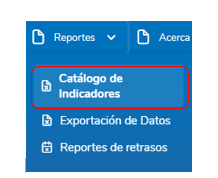
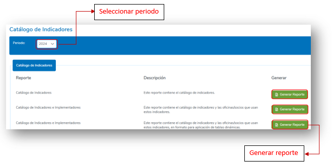
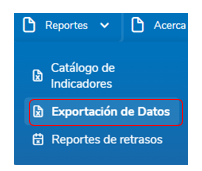
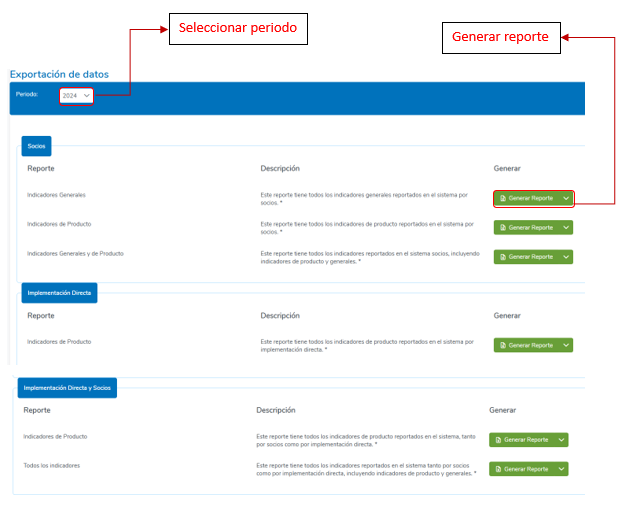
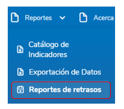
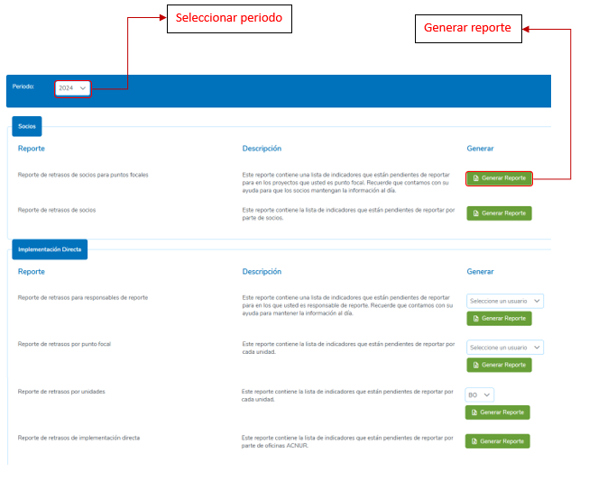

# 8. REPORTES
La sección de Reportes permite al usuario generar diversos informes relacionados con indicadores y otros aspectos clave de la gestión del sistema. Esta funcionalidad está diseñada para facilitar el análisis, seguimiento y toma de decisiones.

## 8.1 Catálogo de Indicadores
Para generar reportes basados en el catálogo de indicadores para socios e implementaciones directas, se deberá hacer clic en la sección de “Reportes”, luego dar clic sobre la opción “Catálogo de Indicadores”.

  

### Tipos de Reportes Disponibles
1. **Catálogo de Indicadores**  
   Este reporte contiene una lista completa de todos los indicadores registrados en el sistema, incluyendo su descripción y características principales.
   
2. **Catálogo de Indicadores e Implementadores**  
   Este reporte incluye el catálogo de indicadores junto con las oficinas o socios implementadores que utilizan cada indicador.
   
3. **Catálogo de Indicadores e Implementadores (Formato Tablas Dinámicas)**  
   Similar al reporte anterior, este informe contiene el catálogo de indicadores y las oficinas/socios que los emplean, pero estructurado específicamente para facilitar el análisis mediante tablas dinámicas.

### Pasos para Generar un Reporte
1. **Seleccionar el Período de Reporte**  
   En la pantalla de Catálogo de Indicadores, elegir el período del cual se desea generar el informe.
   
2. **Elegir el Tipo de Reporte**  
   Identifique el reporte que se necesita generar y dar clic en el botón "Generar reporte" correspondiente a la opción seleccionada.
   
3. **Descargar el Reporte**  
   El sistema generará automáticamente el archivo y lo descargará en formato Excel.

   

  

## 8.2 Exportación de Datos
Para generar reportes basados en los valores reportados de indicadores para socios e implementaciones directas, se deberá hacer clic en la sección de “Reportes”, luego dar clic sobre la opción “Exportación de Datos”.

 

  

### Tipos de Reportes Disponibles
1. **Socios**
   - **Indicadores Generales**  
     Este reporte tiene todos los indicadores generales reportados en el sistema por socios. 
   - **Indicadores de Producto**  
     Este reporte tiene todos los indicadores de producto reportados en el sistema por socios.
   - **Indicadores Generales y de Producto**  
     Este reporte tiene todos los indicadores reportados en el sistema por socios, incluyendo indicadores de producto y generales.
   
2. **Implementación Directa**
   - **Indicadores de Producto**  
     Este reporte tiene todos los indicadores de producto reportados en el sistema por implementación directa.
   
3. **Implementación Directa y Socios**
   - **Indicadores de Producto**  
     Este reporte tiene todos los indicadores de producto reportados en el sistema, tanto por socios como por implementación directa.
   - **Todos los indicadores**  
     Este reporte tiene todos los indicadores reportados en el sistema tanto por socios como por implementación directa, incluyendo indicadores de producto y generales.

### Pasos para Generar un Reporte
1. **Seleccionar el Período de Reporte**  
   En la pantalla de Exportación de datos, elegir el período del cual se desea generar el informe.
   
2. **Elegir el Tipo de Reporte**  
   Identifique el reporte que se necesita generar y dar clic en el botón "Generar reporte" correspondiente a la opción seleccionada.
   
3. **Descargar el Reporte**  
   El sistema generará automáticamente el archivo y lo descargará en formato Excel.

  

## 8.3 Reportes de Retrasos
Para generar reportes basados en los indicadores de ejecución que presentan retrasos en sus reportes de valores tanto para socios e implementaciones directas, se deberá hacer clic en la sección de “Reportes”, luego dar clic sobre la opción “Reporte de retrasos”.

  

### Tipos de Reportes Disponibles
1. **Socios**
   - **Reporte de retrasos de socios para puntos focales**  
     Este reporte contiene una lista de indicadores que están pendientes de reportar para los proyectos en los que usted es punto focal. Recuerde que contamos con su ayuda para que los socios mantengan la información al día.
   - **Reporte de retrasos de socios**  
     Este reporte contiene la lista de indicadores que están pendientes de reportar por parte de socios.
   
2. **Implementación Directa**
   - **Reporte de retrasos para responsables de reporte**  
     Este reporte contiene una lista de indicadores que están pendientes de reportar para los cuales usted es responsable de reporte. Recuerde que contamos con su ayuda para mantener la información al día.
   - **Reporte de retrasos por punto focal**  
     Este reporte contiene la lista de indicadores que están pendientes de reportar por cada unidad.
   - **Reporte de retrasos por unidades**  
     Este reporte contiene la lista de indicadores que están pendientes de reportar por cada unidad.
   - **Reporte de retrasos de implementación directa**  
     Este reporte contiene la lista de indicadores que están pendientes de reportar por parte de oficinas ACNUR.

### Pasos para Generar un Reporte
1. **Seleccionar el Período de Reporte**  
   En la pantalla de Retrasos en reportes de indicadores, elegir el período del cual se desea generar el informe.
   
2. **Elegir el Tipo de Reporte**  
   Identifique el reporte que se necesita generar.  
   Para algunos reportes de Implementación Directa es necesario seleccionar antes el usuario responsable del reporte, punto focal o Unidad.
   
3. **Descargar el Reporte**  
   El sistema generará automáticamente el archivo y lo descargará en formato Excel.

  

