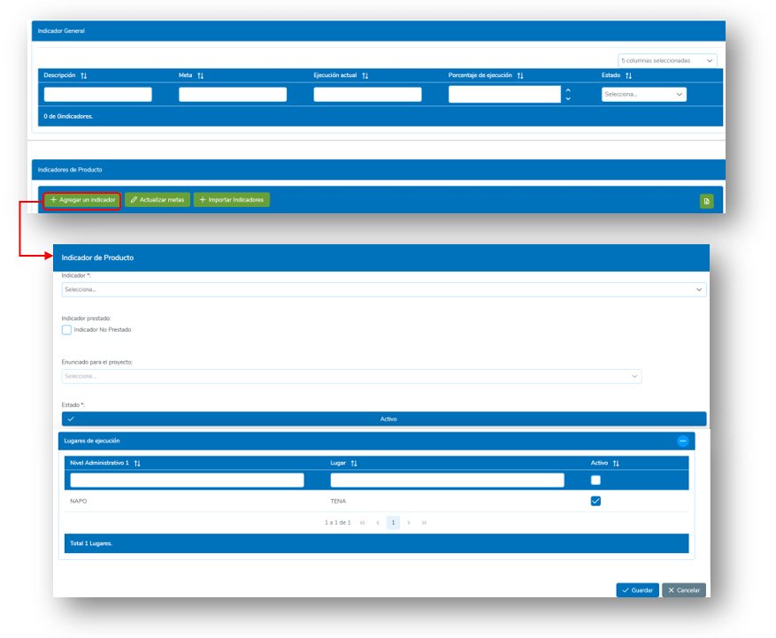
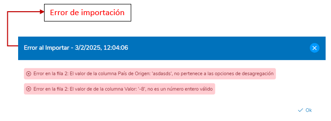

# 6. SOCIOS

En la sección de **Socios**, el Usuario podrá realizar la creación, monitoreo, reporte de valores y generar diferentes tipos de reportes referentes a los proyectos asignados al Socio Implementador correspondiente.

## 6.1 Proyectos

Para acceder a la pantalla de **Proyectos de Socios**, se debe dar clic en el menú en la sección de **“Socios”**, luego dar clic sobre la opción de **Proyectos**.

  

Dentro de la pantalla de proyectos de Socios, tenemos en la parte superior un campo de selección y dos botones, los cuales permiten al usuario:

- Seleccionar el **Periodo** para mostrar el listado de proyectos pertenecientes al mismo y crear nuevos en el periodo seleccionado.
- **Crear nuevos proyectos**
- **Exportar** la información de la tabla a un archivo tipo “.xls”.

  

### 6.1.1 Crear nuevo Proyecto

Para crear un nuevo proyecto, se deberá dirigirse a los botones de la parte superior derecha de la pantalla de **Proyectos** y presionar sobre el botón de **“Crear”**. A continuación, se abrirá una pantalla en la cual se deberá completar con cada uno de los campos que se presenten. Por último, se deberá presionar sobre el botón **“Guardar”** para crear un nuevo proyecto o en **“Cancelar”** si no se desea hacerlo.

Se debe completar primero cada uno de los campos de la **primera sección** para que el botón de **“Guardar”** se habilite.

#### Campos de la primera sección:
- **Número de Acuerdo**: Código del proyecto.
- **Nombre del Acuerdo**: Nombre del proyecto.
- **Estado**: El estado del proyecto este puede ser “Activo” o “Inactivo”.
- **Socio**: Socio implementador del proyecto.
- **Año de Implementación**: Periodo en el cual el proyecto será implementado. Esta opción se completa automáticamente al seleccionar el periodo en la tabla de administración de proyectos.
- **Fecha de Inicio de Implementación**: Fecha de Inicio del proyecto.
- **Fecha de fin de Implementación**: Fecha de fin del proyecto.
- **Responsable del Proyecto (ACNUR)**: Usuarios de ACNUR responsables del monitoreo proyecto.
- **Supervisor de Reporte (Socio)**: Usuario de la Organización Implementadora encargada de la supervisión del proyecto.
- **Lugares de Ejecución**: Lugares en los cuales se implementará el proyecto.

  

Una vez completada la información de la primera sección, se deberá hacer clic en el botón **“Guardar”**. 

A continuación, aparecerá un mensaje y una alerta que nos indica que el proyecto no tiene asignado todavía ningún indicador de producto, lo cual se deberá hacer a continuación completando los campos de la **segunda sección**.

  

#### Campos de la segunda sección:
- **Indicador General**: Indicador general para el proyecto, este aplica si el periodo o año de implementación del proyecto tiene un indicador general.
- **Indicador de producto**: Indicadores de producto que tendrá el proyecto, para agregar los indicadores se deberá hacer clic en el botón **“Agregar un Indicador”** y completar el siguiente formulario:
  - **Indicador**: Indicador de producto que será asignado al proyecto.
  - **Indicador Prestado**: Señala si el Indicador es prestado o no.
  - **Enunciado para el proyecto**: Enunciado correspondiente al indicador seleccionado (Este campo se completa solo y no se puede editar).
  - **Estado**: El estado del proyecto este puede ser “Activo” o “Inactivo”.
  - **Lugares de Ejecución**: Lugares en los que el Indicador se implementará, por defecto aparecerán todos los lugares que se asignaron al proyecto, aquí se podrán desactivar los que no se deseen colocar para el Indicador.

  

Una vez completado el formulario de Indicador de producto, dar clic en el botón **“Guardar”**, seguidamente aparecerá una ventana para establecer la meta del Indicador, aquí se deberá colocar un valor numérico y después dar clic en **“Guardar”**.

  

### Importar Indicadores

En la creación y edición de proyectos también se podrá importar los indicadores mediante una plantilla. Para esto, se deberá presionar sobre el botón **“Importar indicadores”** en la parte inferior, luego dar clic en **“descargar la plantilla”**. Cuando se tenga completa la plantilla en Excel, dar clic en **“seleccionar archivo”** y luego dar clic en **“Guardar”**.

  

### 6.1.2 Tabla de Proyectos

Dentro de la pantalla de **Proyectos**, podremos observar una tabla de los registros de todos los proyectos que se hayan creado en el sistema. Estos registros aparecerán con las columnas de información más relevantes, en caso de querer mostrar otra columna, el usuario podrá hacer clic en la parte superior de la tabla y seleccionar las columnas de información que requiere mostrar.

  

En cada columna de la tabla, el usuario podrá aplicar un filtro para poder buscar algún registro en específico. Estos filtros pueden aplicarse de manera simultánea si se quieren colocar más de uno. Para eliminar el filtro, el usuario puede dar clic en el ícono de filtro que se encuentra a lado del campo.

  

El usuario también podrá ordenar de manera ascendente o descendente los registros de la tabla por una columna específica dando un clic en el nombre de la columna que desea ordenar de manera ascendente y dando otro clic adicional para ordenar de manera descendente.

  

### 6.1.3 Pantalla de Proyecto

Para acceder a un proyecto y poder monitorearlo, reportar valores o generar algún reporte, el usuario deberá hacer clic en el botón **“Ir a proyecto”** sobre la fila del proyecto que desea abrir.

  

En la parte superior de la pantalla de proyecto se visualiza el título del Proyecto y los campos característicos del mismo como el periodo, Código, Organización, puntos focales, fechas y el estado. 

  

Debajo del encabezado se presentan diferentes botones que permiten al usuario realizar las siguientes acciones:

- Bloqueo masivo de meses
- Editar lugares de ejecución
- Reporte del proyecto
- Reporte de retraso de indicadores

  

#### 6.1.3.1 Bloqueo masivo de meses

El sistema permite bloquear o desbloquear un mes de reporte para todos los indicadores de forma masiva. A continuación, se describen los pasos para realizar esta acción:

**Pasos para Bloquear o Desbloquear un Mes**:
1. **Acceder a la Función de Bloqueo**:
   - Haga clic en el botón **"Bloqueo de Indicadores"**, ubicado en la pantalla de administración correspondiente.
2. **Seleccionar el Mes**:
   - Se desplegará un panel que muestra una lista de meses disponibles.
   - Junto a cada mes habrá un botón que permite bloquear o desbloquear ese mes para todos los indicadores.
3. **Bloquear un Mes**:
   - Para bloquear un mes, haga clic en el botón correspondiente al mes seleccionado.
   - Una vez presionado el botón, todos los indicadores quedarán bloqueados para ese mes, impidiendo la edición o actualización de datos relacionados.
4. **Desbloquear un Mes**:
   - Para revertir el bloqueo, vuelva a hacer clic en el botón del mes correspondiente. Esto desbloqueará el mes, permitiendo nuevamente la modificación de los indicadores asociados.

  

#### 6.1.3.2 Editar lugares de Ejecución

La función **Editar Lugares de Ejecución** permite al usuario gestionar los lugares asignados a un proyecto, agregando o eliminando ubicaciones según sea necesario.

**Pasos para Editar los Lugares de Ejecución**:
1. **Acceder a la Función**:
   - En la pantalla del proyecto, haga clic en el botón **"Editar Lugares de Ejecución"**.
2. **Gestión de Lugares**:
   - Al hacer clic, se abrirá una ventana emergente donde podrá realizar las siguientes acciones:
     - **Agregar Lugares**: Seleccione nuevas ubicaciones de la lista disponible y añádalas al proyecto.
     - **Eliminar Lugares**: Identifique los lugares que desea eliminar y quítelos del listado asociado al proyecto.
3. **Guardar Cambios**:
   - Una vez realizadas las modificaciones, haga clic en el botón **"Guardar"** para confirmar los cambios.

  

#### 6.1.3.3 Reporte del Proyecto

La función de **Reporte del Proyecto** permite al usuario generar informes detallados sobre el estado y el progreso del proyecto en distintos formatos y períodos. Estos reportes son descargables en formato Excel para facilitar su análisis y distribución.

Al hacer clic en la flecha desplegable del botón **"Reporte del Proyecto"**, se mostrarán las siguientes opciones:

- **Total**: Genera un reporte completo con toda la información del proyecto.
- **Trimestral**: Proporciona un informe del estado del proyecto agrupado por trimestres.
- **Mensual**: Ofrece un resumen detallado del proyecto agrupado por meses.
- **Con Desagregaciones**: Presenta un reporte del proyecto con los datos desglosados según los tipos de desagregaciones.

**Pasos para Generar un Reporte**:
- Haga clic en la flecha desplegable junto al botón **"Reporte del Proyecto"**.
- Seleccione la opción del tipo de reporte que desea generar.
- El sistema procesará su solicitud y descargará automáticamente el reporte seleccionado en formato Excel.

  

#### 6.1.3.4 Reporte de Retrasos de indicadores

La funcionalidad **Reporte de Retraso de Indicadores** permite generar un informe detallado que identifica los indicadores con retrasos en el reporte de valores. El informe también incluye los puntos focales responsables y los meses afectados por dichos retrasos.

**Pasos para Generar el Reporte de Retraso de Indicadores**:
1. En la pantalla principal o en la sección correspondiente, localice el botón **"Reporte de Retraso de Indicadores"**.
2. Haga clic en el botón para iniciar la generación del informe.
3. El sistema procesará la solicitud y descargará automáticamente un archivo en formato Excel.

  

### 6.1.4 Tabla de Indicadores

Dentro de la pantalla de **Proyecto**, podremos observar una tabla de todos los Indicadores asociados al proyecto seleccionado. Estos indicadores aparecerán con las columnas de información más relevantes. En caso de querer mostrar otra columna, el usuario podrá hacer clic en la parte superior de la tabla y seleccionar las columnas de información que requiere mostrar.

  

En cada columna de la tabla, el usuario podrá aplicar un filtro para poder buscar algún indicador en específico. Estos filtros pueden aplicarse de manera simultánea si se quieren colocar más de uno. Para eliminar el filtro, el usuario puede dar clic en el ícono de filtro que se encuentra a lado del campo.

  

Al igual que con los proyectos, el usuario podrá ordenar los indicadores por alguna columna en específico de manera ascendente o descendente dando clic en el nombre de la columna.

  

## Exportar Indicadores

La función **Exportar Indicadores** permite al usuario descargar un archivo en formato Excel que contiene la información de la tabla de los indicadores de ejecución asociados a un proyecto específico.

### Pasos para Exportar la Tabla de Indicadores

1. En la parte superior derecha de la tabla de indicadores, localice el botón verde con el ícono de un documento.
2. Haga clic en el botón.
3. El sistema generará y descargará automáticamente un archivo Excel con la información de los indicadores.

  

## 6.1.5 Reporte de valores de Indicador

La función **Reporte de Valores de Indicador** permite al usuario registrar y actualizar los valores de ejecución de un indicador en un proyecto, organizados por meses y trimestres. Este proceso asegura que los datos estén completos, correctos y alineados con las desagregaciones del indicador.

### Pasos para Reportar Valores de un Indicador

1. **Acceder a la Tabla de Indicadores**  
   - En la pantalla del proyecto deseado, localice la tabla de indicadores.  
   - Identifique el indicador en el que desea reportar valores.

2. **Seleccionar "Ver Valores"**  
   - Haga clic en el botón **"Ver Valores"** ubicado en la fila del indicador correspondiente.  
   - Se abrirá un panel que muestra los valores ya reportados organizados por meses y trimestres.

3. **Elegir el Mes para Reportar Valores**  
   - Junto a cada mes, habrá un botón **"Ver Valores"**.  
   - Haga clic en el botón correspondiente al mes que desea reportar.

4. **Completar la Información en la Pantalla de Reporte**  
   - En la pantalla desplegada, se mostrará una tabla para cada tipo de desagregación asociada al indicador.  
   - Introduzca los valores correspondientes en cada tabla. Asegúrese de que:
     - Los totales entre las tablas coincidan.
     - Los valores por opciones de desagregación compartidas sean consistentes.
   - Complete el campo **"Información Cualitativa"** ubicado en la parte inferior, proporcionando detalles adicionales sobre los valores reportados.

5. **Guardar los Valores**  
   - Una vez ingresados todos los datos, haga clic en el botón **"Guardar"** para registrar los valores del mes seleccionado.

### Validación de Datos

- Cada tabla de desagregación de reporte debe validar sus totales para asegurar que coincidan con los totales de las demás tablas. Sin embargo, no todas las tablas requieren esta validación. Para identificar cuáles no necesitan validación, se debe observar el color del encabezado de la tabla. Si el encabezado tiene un color azul oscuro, esta desagregación no requiere validación de totales con otras tablas.
  
- En el caso de las desagregaciones que sí requieren validación de totales, si los totales no coinciden entre las tablas o entre las opciones de desagregación compartidas, el sistema generará una alerta que indicará las inconsistencias específicas.
  
- Corrija los valores según las indicaciones antes de guardar los datos.

  
  
  
  

## 6.1.6 Reporte de valores de Indicador por Importación

La función de **Reporte de Valores de Indicador por importación** permite al usuario registrar y actualizar los valores de ejecución de un indicador en un proyecto de manera masiva mediante una plantilla. Este proceso asegura que los datos estén completos, correctos y alineados con las desagregaciones del indicador.

### Pasos para Reportar Valores de un Indicador por Importación

1. **Acceder a la Tabla de Indicadores**  
   - En la pantalla del proyecto deseado, localice la tabla de indicadores.  
   - Identifique el indicador en el que desea reportar valores.

2. **Seleccionar "Ver Valores"**  
   - Haga clic en el botón **"Ver Valores"** ubicado en la fila del indicador correspondiente.  
   - Se abrirá un panel que muestra los valores ya reportados organizados por meses y trimestres.

3. **Elegir el Mes para Reportar Valores**  
   - Junto a cada mes, habrá un botón **"Ver Valores"**.  
   - Haga clic en el botón correspondiente al mes que desea reportar.

4. **Descargar la Plantilla de Reporte**  
   - En cada tabla de desagregación, en la parte superior se encontrará un botón con el nombre **"Importar valores"**.  
   - Dar clic en el botón de **"Importar valores"**.  
   - En la ventana de Importación de datos que se despliega, dar clic en **"Generar plantilla"**.

5. **Completar la Información en la Plantilla de Reporte**  
   - Introduzca los valores correspondientes en cada columna de la plantilla. Asegúrese de que:
     - Las filas del documento no se repitan.
     - Los valores en cada columna sean consistentes.
     - No existan columnas de reporte vacías.
     - No haya otros valores fuera de la tabla de la plantilla.

6. **Importar la Plantilla de Reporte**  
   - En la ventana de Importación de datos, dar clic en **"Seleccionar archivo"**.  
   - Seleccionar la plantilla previamente llena que se desea importar.  
   - En el campo de selección de **"Hoja"**, escoger la hoja del documento donde se encuentran los datos.  
   - Dar clic en el botón **"Importar"**.

7. **Completar la Información en la Pantalla de Reporte**  
   - Seguir el mismo procedimiento de importación para el resto de las tablas de haberlas.  
   - Completar el campo **"Información Cualitativa"** ubicado en la parte inferior, proporcionando detalles adicionales sobre los valores reportados.

8. **Guardar los Valores**  
   - Una vez ingresados todos los datos, haga clic en el botón **"Guardar"** para registrar los valores del mes seleccionado.

### Validación de Datos

- Si los valores en la plantilla de Importación tienen inconsistencias al momento de importar, se presentará una alerta indicando qué filas del documento contienen los errores.
- La validación de totales se realiza siguiendo el criterio mencionado en el apartado anterior, estos dependeran si las tablas de desagregación requieren validación de totales y de tener inconcistencias entre estas, se presentara una ventana indicando los errores específicos.
- Corrija los valores según las indicaciones antes de guardar los datos.

  
  
  
  
  

